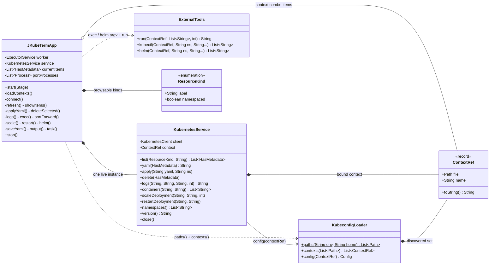
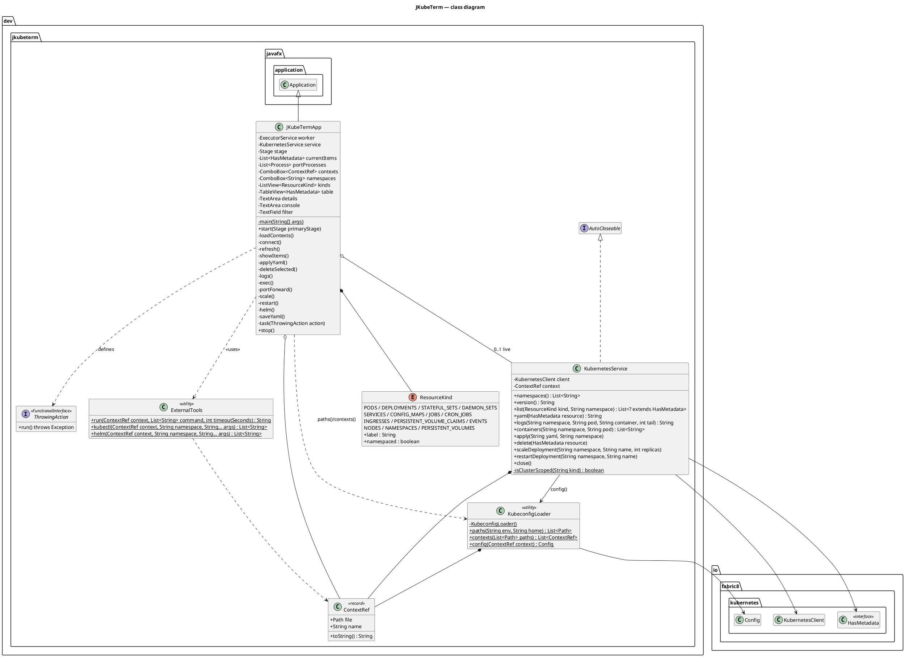

# Components & modules

This page documents every class in `dev.jkubeterm`, its collaborators and its
public API. Full class diagram in PlantUML is at the bottom; Mermaid equivalents
are in [diagrams/mermaid.md](../diagrams/mermaid.md#10-class-diagram).

## 1. Type overview

## 2. `JKubeTermApp` — presentation & orchestration

`public final class JKubeTermApp extends Application`
(`src/main/java/dev/jkubeterm/JKubeTermApp.java:23`)

### Responsibilities

1. Build the scene: `BorderPane` with a toolbar on top, a `SplitPane` in the
   center (kind list @15% / middle table area @55% / right pane with actions,
   manifest editor and console) and a status bar at the bottom. Scene size
   1380×840, stylesheet `/jkubeterm.css`.
2. Wire every user event to a private handler.
3. Own the **worker executor** and translate events into worker tasks.
4. Own **port-forward child processes** (only flow that does not go through
   `ExternalTools.run`, because it must stay alive).
5. Implement the application lifecycle (`start`/`stop`).

### UI structure

| Region | Controls | Behaviour |
|---|---|---|
| Menu bar | **Help** (User guide, Admin guide, QuickStart, About), **Tutorial** (Start guided tour, First deploy drill, Debug flow drill, Stop tutorial) | Help opens info dialogs with docs links; Tutorial starts/stops `Tutorial` wizard (hint strip + `tutorial-target` highlight + Next/Exit buttons in actions pane) |
| Top toolbar | `ComboBox<KubeconfigLoader.ContextRef>` (w=265), **Connect**, **↻ Config**, `ComboBox<String>` namespaces (w=165), **Refresh**, **Diagnose** | Connect → `connect()` (failure prints `ConnectionDiagnostics.describe` to console); ↻ Config → `loadContexts()`; namespace change → `refresh()`; Diagnose → `diagnose()` (step-by-step `[OK]/[FAIL]` + FIX hints) |
| Tutorial hint | `Label.tutorial-hint` under toolbar (hidden unless touring) | `«Tutorial i/N — title + body»`; Next/Finish advances, Exit stops and clears highlight |
| Left | icons + `ListView<ResourceKind>` (w=180) | All 14 kinds with inline-SVG icons (`ClusterVisuals`, distinct path + color per kind); selection → `refresh()` + catalog hint |
| Middle | catalog hint, filter `TextField` + `TableView<HasMetadata>` | Hint `Label.catalog-hint` with kind icon + one-line beginner explanation (`ClusterVisuals.explain`); columns Name / Namespace / Kind / Created; filter applies locally (lowercase `contains`) via `showItems()`; constrained flex-last-column resize; double-click / right-click «Drill down…» → `drillDown()` (targets dialog → worker `resolve` → `selectFound`); `⇄ Relations` double-click → catalog-wide `findByName` |
| Right | Edit-mode checkbox, Apply YAML, Delete, Pod logs, Exec command, Port forward, Scale, Restart, Helm releases, Save YAML…, New YAML; manifest `TextArea`; **Object** `TreeView` (`ResourceInspector`); **Under the hood** explainer; **Best practices** findings (`ClusterAdvisor`); console `TextArea` | FlowPane of actions; `editMode.selectedProperty` toggles manifest editability; row selection loads `service.yaml(item)` + `showObject(item)` (typed sections + ⇄ Relations graph) + `showHoodAndAdvice(item)` and resets edit mode; ConfigMap PEM rows (`⤓`, `isPemCertificate`) double-click → `exportEntry()` FileChooser save |
| Bottom | status `Label` | Every state transition writes a status message |

### Instance state

| Field | Type | Purpose |
|---|---|---|
| `worker` | `ExecutorService` (`newSingleThreadExecutor`, daemon thread `"jkubeterm-kubernetes-io"`) | All blocking work |
| `service` | `KubernetesService` | The live connection; `null` until first Connect succeeds |
| `currentItems` | `List<HasMetadata>` (immutable copy) | Last listed rows, filtered locally by `showItems()` |
| `portProcesses` | `CopyOnWriteArrayList<Process>` | Live port-forward processes, destroyed on exit |
| `stage` | `Stage` | Used by the Save YAML `FileChooser` |
| `tutorial` / `tutorialIndex` | `Tutorial` / `int` | Active wizard script + current step; `null`/`-1` when idle |
| `tutorialHighlighted` | `List<Node>` | Nodes carrying `tutorial-target` class, cleared per step/exit |

### Key methods

| Method | Thread | Behaviour |
|---|---|---|
| `loadContexts()` | FX | `KubeconfigLoader.paths($KUBECONFIG, user.home)` → `contexts(paths)` → fill combo, select first, status `«N contexts from M kubeconfig file(s)»` |
| `connect()` | FX → worker → FX | Builds `KubernetesService` on worker, calls `version()` + `namespaces()`; on success swaps service (closing the old one), fills namespaces (prefers `default`), status `«Connected: X \| Kubernetes Y»`, triggers `refresh()`; on failure closes the new client and rethrows |
| `refresh()` | FX → worker → FX | Guarded on live service + selected kind; `List.copyOf(service.list(kind, ns))`, then update table via `showItems()` |
| `showItems()` | FX | Local name filter: `name.toLowerCase(Locale.ROOT).contains(query)` with null guards |
| `applyYaml()` / `deleteSelected()` / `scale()` / `restart()` | FX → worker → FX | Confirmation dialog first (`confirm()`), then worker task, then `refresh()` |
| `logs()` | FX → worker → FX (×2) | Fetch containers on worker, show `ChoiceDialog`, then fetch `logs(ns, pod, container, 500)` |
| `exec()` | FX → worker | `ExternalTools.kubectl(..., "exec", pod, "--", command.strip())` then `ExternalTools.run(argv, 30)` |
| `portForward()` | FX (+worker reader) | Validates `local:remote` (regex + 1–65535), starts `kubectl port-forward --address 127.0.0.1 kind/name ports` via `ProcessBuilder`, tracks process, drains output on worker |
| `helm()` | FX → worker | `ExternalTools.helm(..., "list")`, namespace defaults to `default`, 30 s timeout |
| `saveYaml()` / `newYaml` action | FX | File export (`.yaml`/`.yml`) / pre-filled ConfigMap template with edit mode on |
| `task(ThrowingAction)` | FX → worker | Submits; any exception → `Platform.runLater(error dialog «Kubernetes operation failed»)` |
| `startTutorial(Tutorial)` / `stopTutorial()` / `nextTutorialStep()` | FX | Wizard state (`tutorial`, `tutorialIndex`); hint label + `tutorial-target` CSS class on step nodes; Next/Exit buttons appended to actions pane; auto-advance via `advanceTutorial(event)` hooks in `connect`/`refresh`/selection/edit/apply/delete/logs/exec/forward/new-yaml |
| `stop()` | FX | Destroy port-forward processes → `worker.shutdownNow()` → `service.close()` |

### Connection diagnostics

`ConnectionDiagnostics` (`src/main/java/dev/jkubeterm/ConnectionDiagnostics.java:17`)
is a pure-static helper with no JavaFX. `diagnose(context)` runs four ordered
checks — kubeconfig file → kubeconfig parse (Fabric8 `Config`) → API endpoint
(DNS + TCP to master host:port) → API auth (`getKubernetesVersion()` +
`namespaces().list()`) — and renders `[OK]/[FAIL]` lines with `FIX:` hints.
`describe(context, failure)` prefixes the same report with the Connect exception
plus a classified cause hint (TLS / 401 / 403 / unreachable / DNS).
`connect()` prints `describe(...)` to the console before rethrowing to the error
dialog; `refresh()` on an empty result prints the scope (`ns=` vs cluster-scope)
plus a kind-specific hint instead of staying silent. Covered by
`ConnectionDiagnosticsTest` (missing file, unresolvable host, hint classifier).

### Object parser and platform visualization

`ResourceInspector` (`src/main/java/dev/jkubeterm/ResourceInspector.java:29`) is a
pure-static, JavaFX-free parser: `inspect(HasMetadata)` returns ordered `Section`s
(`title` + `Row(field, value)`) plus cross-resource `Relation(from, to, label)`.
Coverage: Pod (phase/IPs/QoS/conditions, container statuses with state decoding,
init + app containers with image/ports/env/envFrom/resources/mounts/probes,
volumes with configmap/secret/pvc backends as relations), Deployment (replicas,
strategy + maxSurge/maxUnavailable, selector, status counts, pod template +
restartedAt rollout marker), StatefulSet (replicas, headless-service relation,
claim templates), DaemonSet (desired/ready/updated), Service (type/clusterIP/
selectors/ports incl. nodePort, externalIPs, LB-ingress relations), ConfigMap
(key preview ≤120 chars, binaryKeys, immutable), Secret (keys + lengths only —
values never exposed), Job/CronJob (completions/parallelism/backoff, schedule/
suspend/history, statuses, pod templates), Ingress (class, host+path→service
route relations, TLS hosts→secret), PVC/PV (accessModes, storageClass,
requests/capacity, phases, bound-to/claimed-by relations), Node (capacity/
allocatable, kubelet/os/arch, Ready conditions, addresses, taints), Namespace
(phase), Event (type/reason/message/count + about-relation). `adjacency()`
builds a from→to map with labels for graph rendering, skipping empty endpoints.
`showObject()` in `JKubeTermApp` renders sections as `§`-nodes and relations as
a `⇄ Relations` subtree in the Object `TreeView` between Manifest and console.
ConfigMap Data rows whose value contains `-----BEGIN CERTIFICATE-----`
(`isPemCertificate`) are prefixed `⤓` with a «double-click to save» hint;
double-click opens a FileChooser prefilled with the key name and writes the
full untruncated value via `exportEntry()` (`ExportableEntry(kind, name, key,
value)`, `exportableEntries()` — pure data, Secret values stay excluded).
Covered by `ResourceInspectorTest` (14 tests incl. secret non-exposure and
certificate export).

### Drill-down navigation

`DrillDown` (`src/main/java/dev/jkubeterm/DrillDown.java:14`) is a static,
JavaFX-free navigator: `targets(HasMetadata)` proposes typed `Target`s per kind
(Pod → node/exact, Events/about, Services/selecting, ConfigMaps+PVCs/exact,
Job/exact from `job-name` label; Deployment/StatefulSet/DaemonSet → Pods/by-labels;
StatefulSet → headless Service + `data-<name>-` PVCs; Service → Pods/by-labels +
Ingresses/backend; ConfigMap → workloads/used-by; Job → Pods/`job-name`,
CronJob → Jobs/owned-by; Ingress → Services/exact; PVC → PV/exact + pods/used-by;
PV → PVC/exact; Node → Pods/on-node; Namespace → namespace-switch; Event →
involved object via `kindForKindName`). `resolve(service, target, currentNs)`
runs the API fan-out on the worker (`EXACT_NAME`, `BY_LABELS` via
`matchesLabels`, `BY_NAME_PREFIX`, `OWNED_BY` via ownerReferences, `USED_BY`
scanning workload pod-specs for configmap/secret/pvc refs, `BACKEND` scanning
Ingress backends, `ON_NODE` by `spec.nodeName`, `ABOUT` by involved object,
`SELECTING` by service selectors, `FIND_BY_NAME` across the catalog order).
UI: table double-click / context menu → `drillDown()` ChoiceDialog →
`followTarget()` (worker resolve) → `followTargetResult()` (single → direct
`selectFound(kind, item)` with kind+namespace switch and row focus; multi →
label picker) → `selectFound()` switches kind/namespace, refreshes and focuses
the row. Object-view `⇄ Relations` links double-click into catalog-wide
`findByName` (`relationTargetKind` maps route/mounts/bound labels to kinds).
Covered by `DrillDownTest` (14 tests: targets per kind, matchers, pod-spec
extraction, ref scanners).

### Vector icons, under-the-hood explainer, best-practice advisor

`ClusterVisuals` (`src/main/java/dev/jkubeterm/ClusterVisuals.java:14`) holds
one inline-SVG path (24x24) plus a hex color per `ResourceKind` — no image
assets, rendered as `SVGPath` in the kinds list cells and the middle-column
catalog hint. `explain(kind)` is a one-line beginner sentence per kind
(hexagon Pod, layered Deployment, database cylinder StatefulSet, grid DaemonSet,
arrow Service, document ConfigMap, play Job, clock CronJob, globe Ingress,
cylinder PVC, bell Events, server Nodes, folder Namespaces, disk PV).

`ClusterAdvisor` (`src/main/java/dev/jkubeterm/ClusterAdvisor.java:16`) is a
JavaFX-free checker: `advise(HasMetadata)` returns `Finding(severity, check,
message, fix)` for Pod/Deployment/StatefulSet/Service/Ingress/CronJob —
missing readiness/liveness probes, missing requests/limits, root/escalation
risks, host namespaces (CRITICAL), floating `:latest` tags, single replica,
Recreate strategy, unfinished rollout, selector-less or NodePort/LoadBalancer
Services, TLS-less or class-less Ingress, suspended/bad-schedule CronJobs,
CrashLoop/ImagePullBackOff Pods. `explainHood(pod)` narrates scheduling in one
sentence; `hoodTextFor()` in the app covers the remaining kinds. The right pane
renders «Under the hood» text plus «Best practices» cards (⛔/⚠️/ℹ️ badges with
message + Fix), or a green «no issues» label. Covered by
`ClusterVisualsAdvisorTest` (icons distinct + valid hex, explain fallback,
advisor triggers, compliant-pod quiet, hood text).

### Practices wiki, per-kind docs, version highlights, attribute help

`PracticeRegistry` (`src/main/java/dev/jkubeterm/PracticeRegistry.java:19`)
is a Markdown wiki DB: bundled `/practices.md` (38 practices, one
`## practice <id>` section with `Kinds/Severity/Title/Docs/### Why/### Fix`),
user overrides at `~/.jkubeterm/practices.md` merged by id (user wins).
`ClusterAdvisor.advise(resource, registry, serverVersion)` resolves every
finding's text through the registry (user edits change messages without code
changes) and backfills passing practices as green INFO cards — «No issues»
never appears while the wiki is non-empty. Every finding carries `docs()` URLs
rendered as clickable `Hyperlink`s (first link inline, count of the rest).
`ClusterVisuals.docsUrl(kind)` maps each kind to its kubernetes.io reference.
Object-view rows are prefixed `?` — double-click opens an attribute help dialog
(`ResourceInspector.helpFor(kind, field)` with ~25 mapped attributes plus
section and kind fallback). Help menu gains **Practices Wiki…** (picker →
full Why/Fix/Docs view → Open wiki file / Reload), **What's new in
Kubernetes…** (`/whats-new.md` highlights per version plus the connected
server's reported version), **Attribute help…** (help for the selected row or
row field). Version-gated advisor checks (`parseVersion`, `versionChecks`):
StatefulSet retention hints on 1.35+, Job successPolicy on 1.36+, Pod resources
on 1.37+. Covered by `PracticeRegistryTest` (bundled size, user override,
highlights, kind filter) and `versionGatedHighlights`.

## 3. `KubernetesService` — Fabric8 facade

`public final class KubernetesService implements AutoCloseable`
(`src/main/java/dev/jkubeterm/KubernetesService.java:15`)

Holds a `KubeconfigLoader.ContextRef` plus the Fabric8 `KubernetesClient`
built from `KubeconfigLoader.config(context)` — TLS verification stays
enabled. All network access happens on the caller's worker thread, never on
the JavaFX thread (class Javadoc).

| Method | Fabric8 call(s) | Notes |
|---|---|---|
| `version()` | `client.getKubernetesVersion().getGitVersion()` | Used as connect health-check |
| `namespaces()` | `client.namespaces().list()` | Sorted names; needs cluster-scope list RBAC |
| `list(kind, ns)` | Switch over 14 kinds — see [Resource catalog](resources.md) | Cluster-scoped kinds ignore `ns` |
| `yaml(resource)` | `Serialization.asYaml(resource)` | Populates the manifest editor |
| `logs(ns, pod, container, tail)` | `pods().inNamespace…withName…inContainer(c).tailingLines(max(1, tail)).getLog()` | Call site uses tail = 500 |
| `containers(ns, pod)` | Pod get + `spec.containers` names | `List.of()` when pod/spec missing |
| `apply(yaml, ns)` | `Serialization.unmarshal` → validation → `client.resource(obj).serverSideApply()` | Validation below |
| `delete(resource)` | `client.resource(resource).delete()` | Uses the object selected in the table |
| `scaleDeployment(ns, name, replicas)` | `apps().deployments()…scale(replicas)` | Rejects negative replicas |
| `restartDeployment(ns, name)` | `apps().deployments()…edit(…)` | Adds `kubectl.kubernetes.io/restartedAt = Instant.now()` to the pod template; throws `IllegalStateException` when the template is missing |
| `close()` | `client.close()` | Called on context switch and app exit |
| `namespaceOrDefault(ns)` | — | Blank/null → `"default"` |

### Apply validation rules (`apply`)

1. Manifest must unmarshal to a non-null `HasMetadata`.
2. `metadata.name` must be present — else `IllegalArgumentException`.
3. `kind` and `apiVersion` must be present — else `IllegalArgumentException`.
4. If `metadata.namespace` is empty **and** the kind is not cluster-scoped
   (see the cluster-scoped list in [Resource catalog](resources.md)),
   the namespace from the namespace combo (default `default`) is injected.
5. Applied with `serverSideApply()`. The operation only ever originates from
   the explicit *Apply YAML* button — never when merely loading a resource
   into the editor (`KubernetesService.java:66`).

> Note: the README's security section still describes the earlier
> "create-or-replace" wording; the code performs **server-side apply** with
> client-side validation. ADR-0006 records this.

## 4. `KubeconfigLoader` — kubeconfig discovery

Utility class (private constructor), three static entry points plus the
`ContextRef` record:

| Member | Behaviour |
|---|---|
| `record ContextRef(Path file, String name)` | Immutable context reference; `toString()` renders `name  [filename]` for the combo box |
| `paths(env, home)` | `$KUBECONFIG` (split on `File.pathSeparator`) or default `~/.kube/config`; entries trimmed, blank-skipped, absolute + normalized, only regular files kept |
| `contexts(paths)` | SnakeYAML-load each file; take `contexts` list entries whose `name` is a non-blank string; **first-seen wins** per name (`LinkedHashMap.putIfAbsent`); returns an immutable list preserving file order |
| `config(context)` | `Config.fromKubeconfig(name, file)` — Fabric8 resolves relative CA/client-cert paths against the kubeconfig file location |

Full algorithm: [Kubeconfig & authentication](kubeconfig.md).

## 5. `ExternalTools` — subprocess bridge

Utility class for argv-based invocation; **no shell is ever involved**.

| Member | Behaviour |
|---|---|
| `run(context, command, timeoutSeconds)` | `ProcessBuilder` + `redirectErrorStream(true)`, injects `KUBECONFIG=context.file()`, waits up to timeout (else `destroyForcibly()` + `IOException`), reads stdout+stderr as UTF-8, non-zero exit → `IOException` with the output |
| `kubectl(context, ns, args…)` | `kubectl --context <name> --kubeconfig <file> --namespace <ns> <args…>` |
| `helm(context, ns, args…)` | `helm --kube-context <name> --kubeconfig <file> --namespace <ns> <args…>` |

Detail and per-feature argv tables: [External tool integration](external-tools.md).

## 6. `ResourceKind` — browsable catalog

Enum with `label` (list display) and `namespaced` flag. 11 namespaced kinds
(Pods, Deployments, StatefulSets, DaemonSets, Services, ConfigMaps, Jobs,
CronJobs, Ingresses, PVCs, Events) and 3 cluster-scoped kinds (Nodes,
Namespaces, PersistentVolumes). The complete mapping to Fabric8 calls:
[Resource catalog](resources.md).

## 7. PlantUML class diagram

## 8. Ownership & lifecycle

| Resource | Created | Closed / destroyed |
|---|---|---|
| Worker executor | `start()` (field init) | `stop()` → `shutdownNow()` |
| `KubernetesService` (Fabric8 client) | worker thread during `connect()` | swapped out on next successful Connect; `stop()` for the last one; closed eagerly on connect failure |
| Port-forward `Process` | FX thread in `portForward()` | `stop()` → `process.destroy()` for alive processes |
| JavaFX stage | JavaFX launch | Application exit |
