# Data flow & sequences

Every user action follows the same pattern: **UI event (FX thread) → optional
confirmation dialog → `task()` on the worker → service/CLI call →
`Platform.runLater` back to the UI**. Below are all flows in order.

Sequence diagrams here use Mermaid; the same flows also exist as PlantUML
sources in [diagrams/plantuml.md](../diagrams/plantuml.md#5-sequence-diagrams).

## 0. Connection lifecycle (state machine)

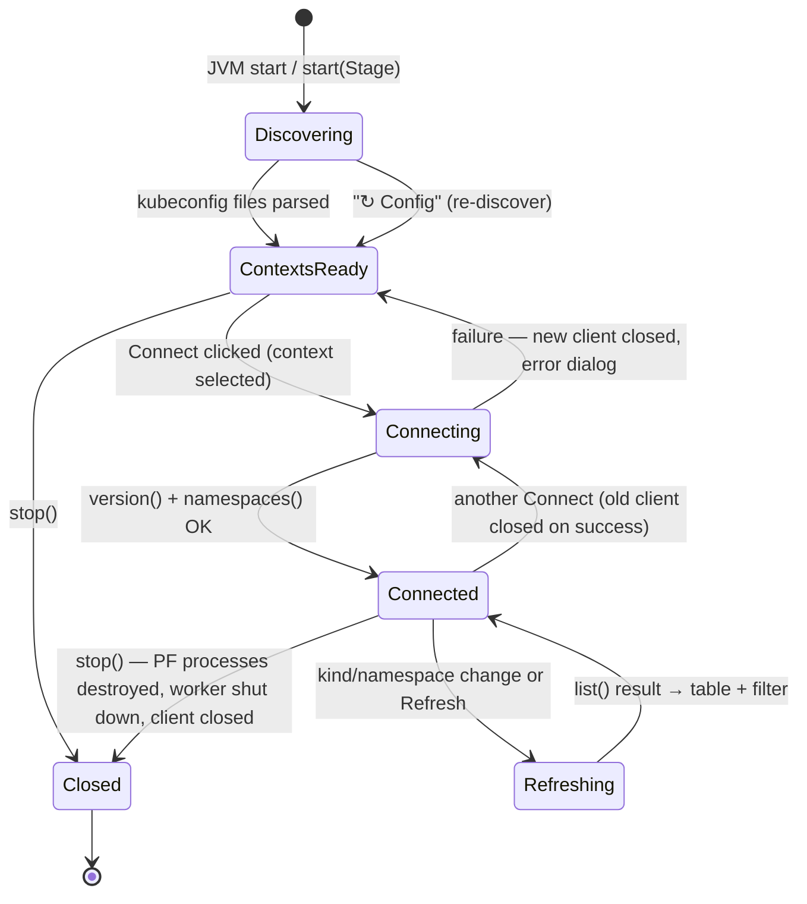

## 1. Startup and context discovery

Runs synchronously at the end of `start()` (`JKubeTermApp.java:86`) and again
on **↻ Config**. File I/O happens on the FX thread (accepted cost, see
[threading caveats](threading.md#caveats)).

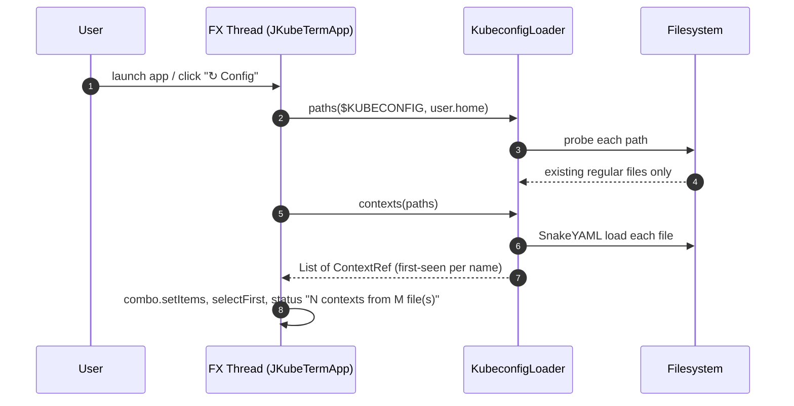

Error path: any exception → `error("Cannot read kubeconfig", ex)` (status bar +
error dialog).

## 2. Connect to a context

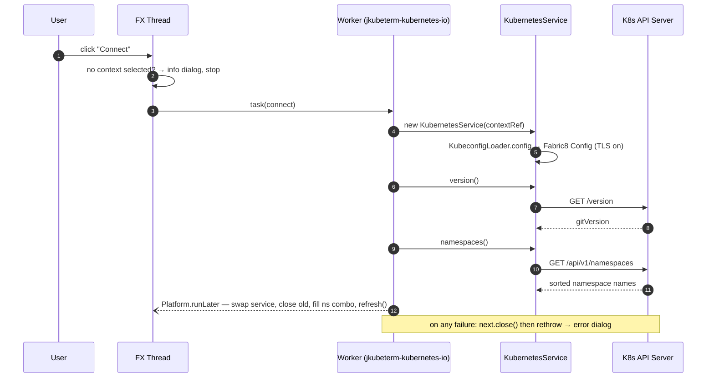

Detail: the swap keeps at most one live client ([overview](overview.md#7-runtime-topology)).

## 3. Browse resources (refresh + local filter)

Triggered by kind selection, namespace change or **Refresh**.

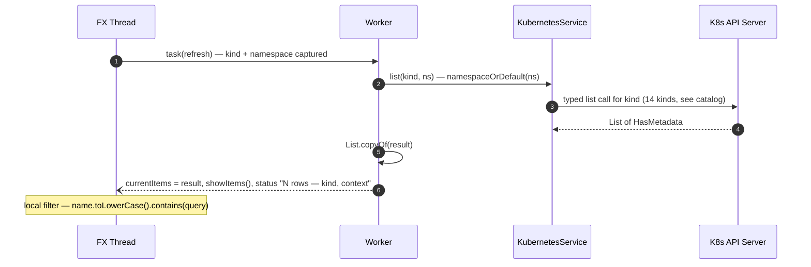

## 4. Inspect and edit YAML

Row selection is synchronous on the FX thread against the already-listed
object — no network call:

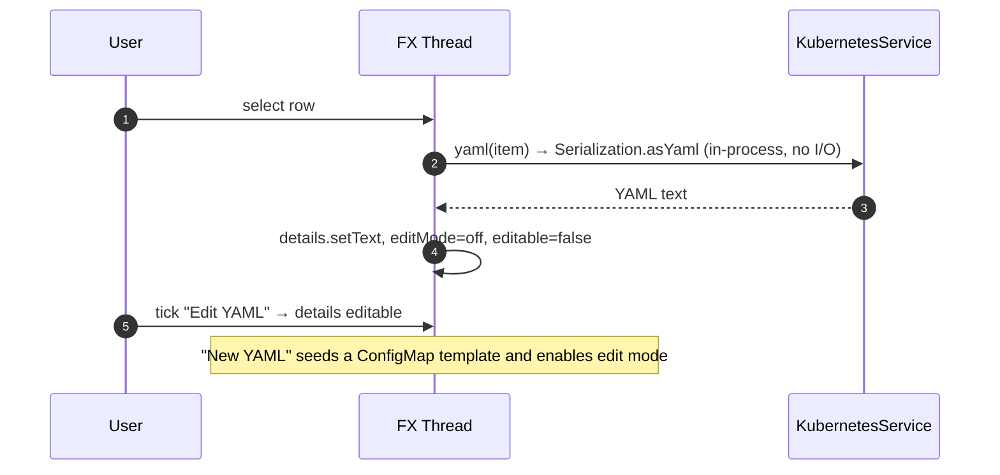

## 5. Apply YAML (server-side apply)

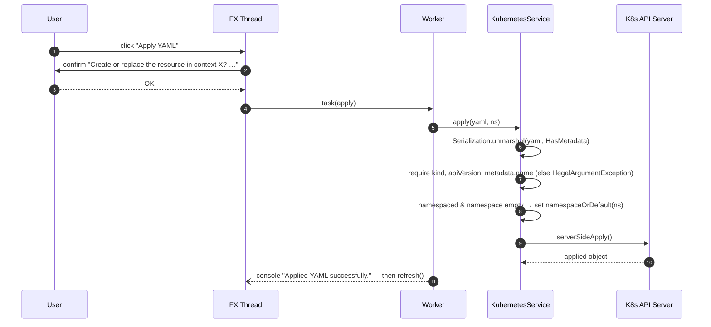

Failure of any step surfaces the exception message in the error dialog; the
manifest in the editor is untouched.

## 6. Delete resource

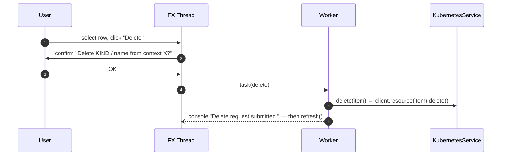

## 7. Pod logs (two-phase, container choice)

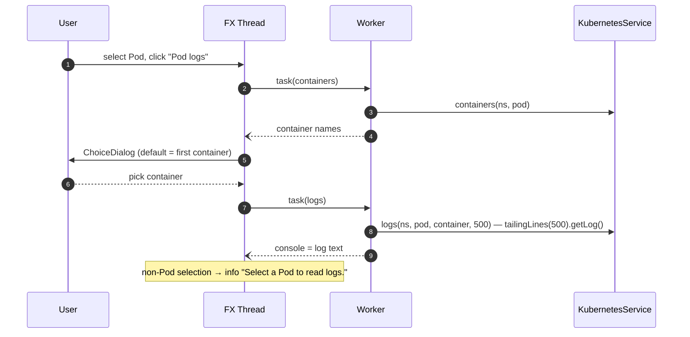

## 8. Exec command via kubectl (one-shot)

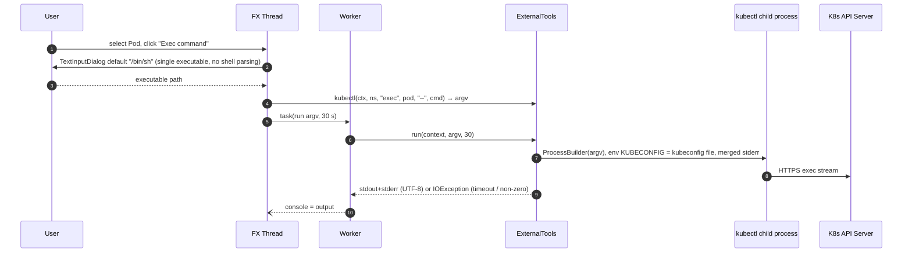

## 9. Port-forward (kubectl subprocess, loopback)

The only long-lived child process; owned by `JKubeTermApp`, not
`ExternalTools`:

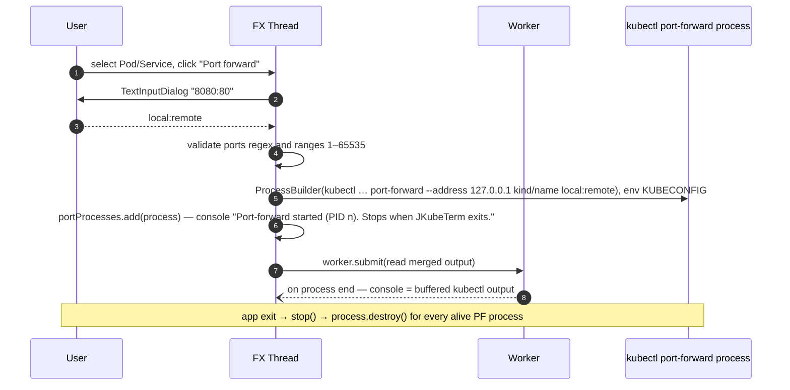

See [external tools](external-tools.md#3-port-forward-special-case) for why
this flow bypasses `ExternalTools.run`.

## 10. Scale / restart a Deployment

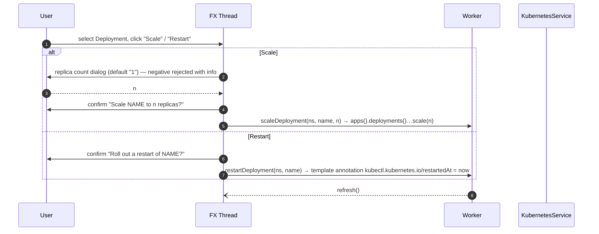

## 11. Helm releases

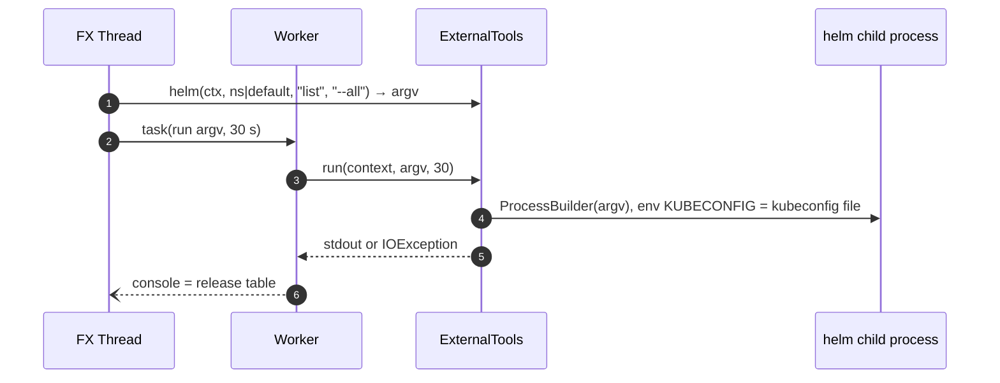

## 12. Export / save YAML

Synchronous, local-only: `FileChooser` (initial name `resource.yaml`, filter
`*.yaml`/`*.yml`) → `Files.writeString`. Errors → `error("Save failed", ex)`.
No cluster interaction.

## 13. Shutdown (`stop()`)

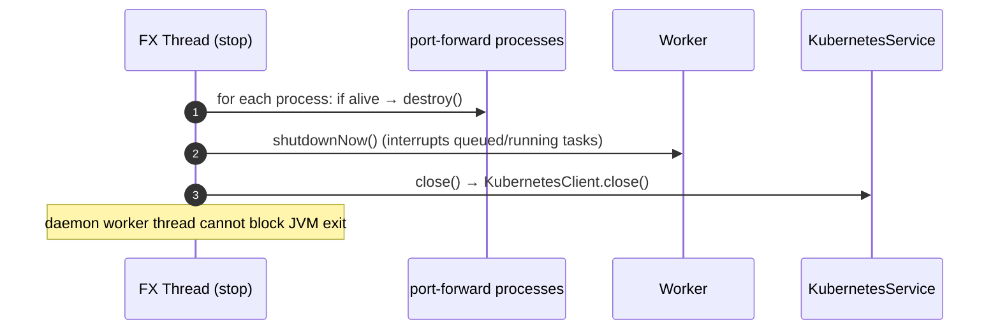

## Error-handling conventions

| Layer | Mechanism |
|---|---|
| Worker tasks | `task()` wraps `ThrowingAction`; exceptions → `Platform.runLater` → error dialog `«Kubernetes operation failed»` |
| Context discovery | Local try/catch → `«Cannot read kubeconfig: …»` |
| Connect | Failure closes the freshly built client before rethrowing (`JKubeTermApp.java:119`) |
| Subprocesses | Non-zero exit or timeout → `IOException` carrying the merged output |
| Status bar | Mirrors every transition (loading/connected/error summaries) |
