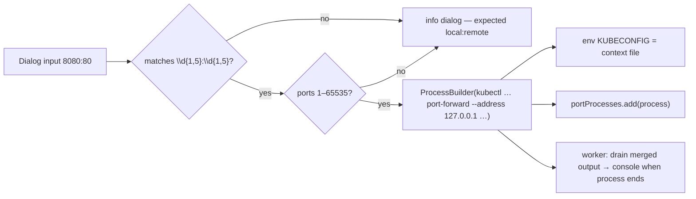
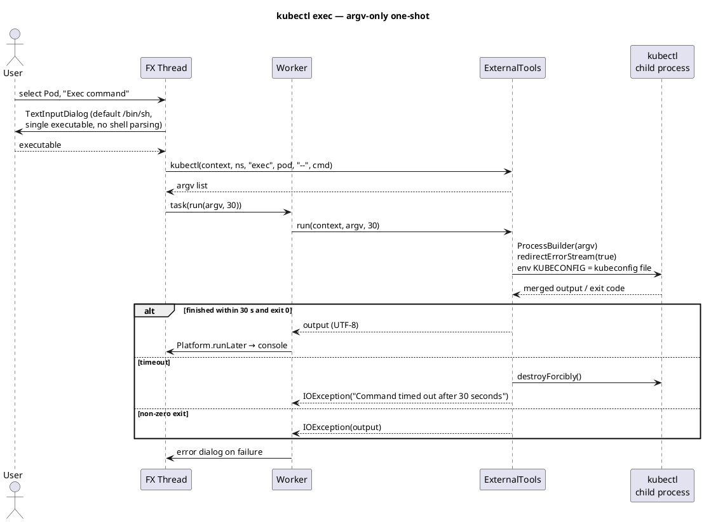

# External tool integration

`ExternalTools` (`src/main/java/dev/jkubeterm/ExternalTools.java:9`) is the
subprocess bridge for optional CLI tools (`kubectl`, `helm`). Its contract is
deliberately narrow and security-first.

## 1. Design rules

| Rule | Rationale |
|---|---|
| **argv-only** — commands are `List<String>` arrays passed to `ProcessBuilder`; no shell, no string concatenation into a command line | Prevents shell injection; special characters in names/paths survive intact |
| `KUBECONFIG=<context file>` is injected into the child environment, and the argv pins `--context`/`--kubeconfig`/`--namespace` (or `--kube-context` for helm) | The child sees exactly the context the user selected, independent of any ambient kubeconfig |
| `redirectErrorStream(true)` — stdout+stderr merged | Tool diagnostics are visible in the console |
| Hard timeout (30 s at call sites); on expiry `destroyForcibly()` + `IOException` | A hung CLI cannot wedge the single worker thread forever |
| Output decoded as UTF-8; non-zero exit → `IOException` carrying the output (or `«Command exited: N»` when output is blank) | Errors surface in the UI error dialog, not silently |
| Exec dialog accepts a **single executable**, explicitly not a shell parser (`JKubeTermApp.java:173`) | No shell parsing happens client-side |

## 2. Argv builders

| Feature | Generated argv |
|---|---|
| Exec | `kubectl --context <name> --kubeconfig <file> --namespace <ns> exec <pod> -- <executable>` |
| Port forward | `kubectl --context <name> --kubeconfig <file> --namespace <ns> port-forward --address 127.0.0.1 <kind>/<pod-or-svc-name> <local>:<remote>` |
| Helm list | `helm --kube-context <name> --kubeconfig <file> --namespace <ns> list --all` |

Both `kubectl()` and `helm()` are pure functions returning the argv list —
they never start processes themselves (`ExternalTools.java:22`,
`ExternalTools.java:26`).

## 3. Port-forward special case

Port-forwarding is **not** routed through `ExternalTools.run`, because:

1. it is a long-running process — a 30 s timeout would kill healthy forwards;
2. the UI needs the `Process` handle to destroy it on application exit
   (`portProcesses`, `JKubeTermApp.java:200`);
3. output is streamed asynchronously rather than collected after exit.

Instead `JKubeTermApp.portForward` (`JKubeTermApp.java:180`) starts the
`ProcessBuilder` itself:

- input validated before launch: regex `[0-9]{1,5}:[0-9]{1,5}` and both ports
  within 1–65535;
- `--address 127.0.0.1` forces **loopback binding**;
- child stdout+stderr is drained on the worker thread and posted to the
  console when the process ends (`readAllBytes`, `JKubeTermApp.java:196`);
- `stop()` destroys every alive process.

## 4. Sequences

### kubectl exec (one-shot, 30 s)

### helm list (30 s)

Same path as exec with argv `helm --kube-context … --kubeconfig … --namespace … list --all`;
the namespace falls back to `default` when the combo is empty
(`JKubeTermApp.java:222`).

## 5. Failure surface

| Condition | Result |
|---|---|
| Binary not on PATH | `ProcessBuilder.start()` throws → `error("Port forwarding failed (kubectl required)", ex)` for port-forward; generic `«Kubernetes operation failed»` dialog for exec/helm |
| Non-zero exit | `IOException` whose message is the merged tool output (shown verbatim) |
| Timeout | `destroyForcibly()` + `IOException("Command timed out after N seconds")` |
| Blank/invalid exec input | Dialog result filtered — no process started |
| Invalid port spec | Info dialog before any process starts |

## 6. Scope and roadmap

| Current | Not implemented yet |
|---|---|
| One-shot exec (single executable) | Interactive exec WebSocket/TTY (roadmap 2) |
| kubectl port-forward, loopback-only, no stop UI | Port-forward manager with stop/reconnect (roadmap 3) |
| `helm list --all` only | Helm install/upgrade/rollback (roadmap 5) |

`kubectl` and `helm` must be on `PATH`; JKubeTerm does not bundle or download
them.
