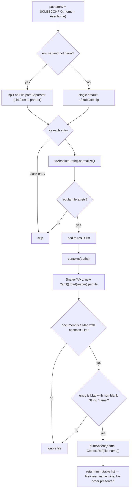
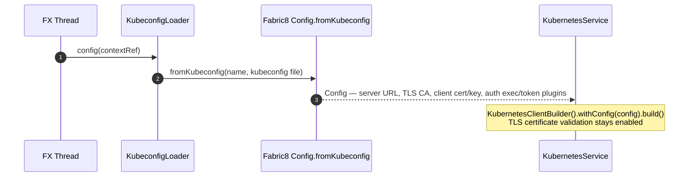
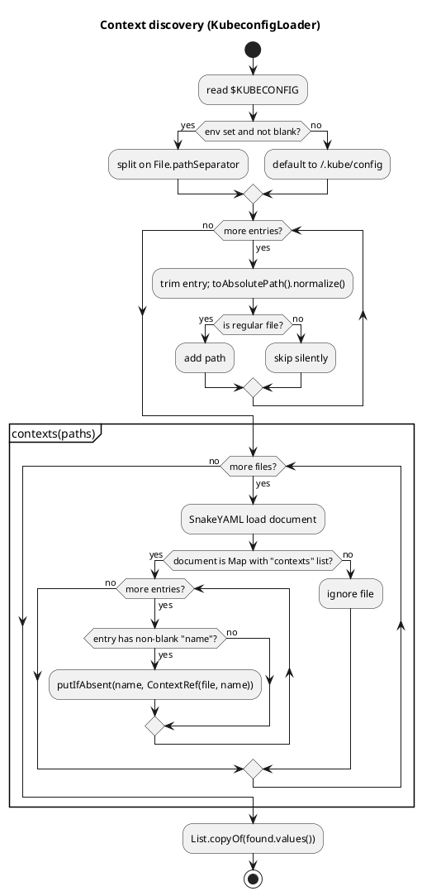

# Kubeconfig & authentication

`KubeconfigLoader` (`src/main/java/dev/jkubeterm/KubeconfigLoader.java:15`) is
the only component that touches kubeconfig files. It is a **read-only,
credential-free** utility: it never sends kubeconfig content anywhere, never
writes files, and for context discovery it deliberately parses only context
*names* (SnakeYAML), delegating all authentication/TLS handling to Fabric8.

## 1. Context discovery algorithm



Behaviour details:

| Aspect | Behaviour |
|---|---|
| Default path | `$HOME/.kube/config` when `$KUBECONFIG` is null or blank (`KubeconfigLoader.java:21`) |
| Multi-file `$KUBECONFIG` | Split on `File.pathSeparator` (e.g. `:` on macOS/Linux); entries trimmed, blanks skipped |
| Missing files | Silently ignored (unit-tested: `KubeconfigLoaderTest.missingPathIsIgnored`) |
| Deduplication | `LinkedHashMap.putIfAbsent` — the **first file declaring a context name wins**; order = kubeconfig file order, then in-file order |
| Malformed YAML / non-map documents | Silently ignored (`continue`) — a broken second kubeconfig never breaks discovery |
| Discovery cost | Reads and parses every listed kubeconfig; runs on the FX thread (see [threading](threading.md#caveats)) |

## 2. Building the Fabric8 client config



- The `ContextRef` name is passed through, so kubectl-style `--context`
  semantics are preserved for multi-context files.
- Fabric8 resolves **relative** `certificate-authority` / client-cert / key
  paths against the kubeconfig file's own location
  (`KubeconfigLoader.java:47`).
- A fresh `Config` is built for every `KubernetesService` construction — there
  is no shared mutable config state between contexts.
- TLS verification is **never** disabled; `certificate-authority-data`,
  `certificate-authority`, client certificates and keys are all handled by
  Fabric8's kubeconfig loader.

## 3. `ContextRef`

```java
public record ContextRef(Path file, String name)
```

- Immutable pair of the kubeconfig file owning the context and the context name.
- `toString()` renders `«name  [filename]»`, which is what the context combo
  box displays (`KubeconfigLoader.java:18`).
- Passed by value into worker tasks (`connect()`, `exec()`, `helm()`), so a
  context switch on the FX thread cannot race an in-flight task.

## 4. Where discovery is used

| Call site | Thread | Purpose |
|---|---|---|
| `JKubeTermApp.loadContexts` (`JKubeTermApp.java:93`) | FX | Fill the context combo at startup and on ↻ Config |
| `JKubeTermApp.connect` (via `KubernetesService` ctor) | Worker | Build the Fabric8 client for the selected context |

## 5. PlantUML rendering of the discovery flow



## 6. Test coverage

`src/test/java/dev/jkubeterm/KubeconfigLoaderTest.java`:

| Test | Assertion |
|---|---|
| `discoversContextsWithoutClusterConnection` | Two contexts (`minikube`, `development`) parsed from a synthetic kubeconfig without any cluster connection |
| `missingPathIsIgnored` | Non-existent paths produce an empty path list |

## 7. Security notes

- Kubeconfig contents (clusters, users, certificates, tokens) are **never
  logged, displayed or exported** by JKubeTerm; only context names are shown.
- Cluster credentials remain local; the application operates no backend
  service ([security](../operations/security.md)).
- `KUBECONFIG` environment handling matches kubectl semantics (multi-path,
  platform separator) so behaviour is predictable for existing setups.
