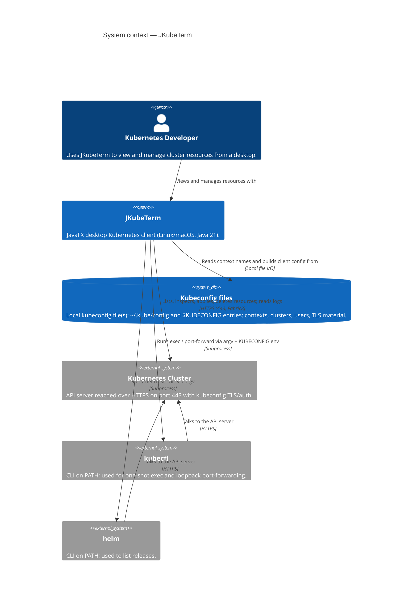
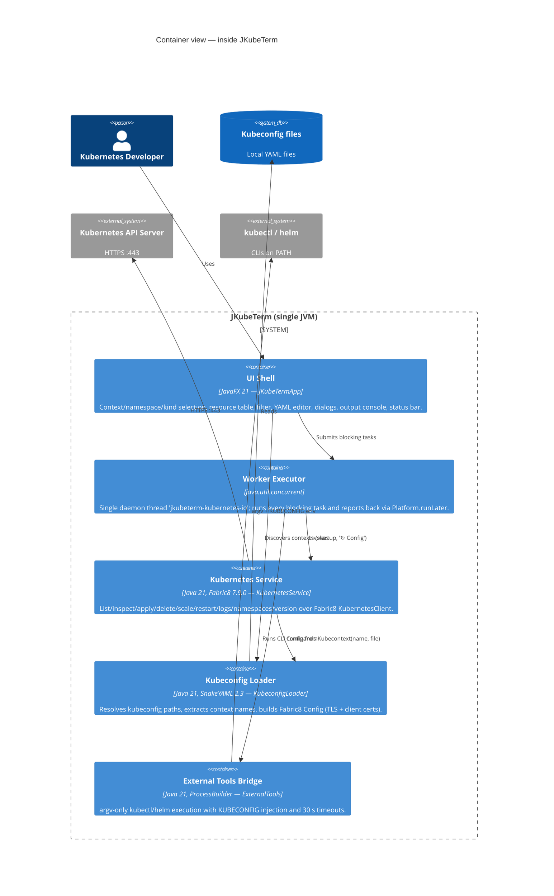

# Architecture overview

JKubeTerm is a **single-process JavaFX desktop application** that talks
directly to a Kubernetes cluster through the Fabric8 client library. There is
no backend service, no telemetry and no credential store of its own — all
cluster access materialises from kubeconfig files already present on the user's
machine.

## 1. Purpose and scope

JKubeTerm lets a developer:

- discover named contexts from `~/.kube/config` or `$KUBECONFIG` (multiple
  paths, platform path separator),
- connect to a context (kubeconfig authentication, CA trust, client
  certificates) and browse 14 resource kinds per namespace,
- inspect, edit, apply (server-side apply), delete and export resource YAML,
- read the last 500 log lines of a Pod container,
- scale and restart Deployments,
- invoke optional external CLIs: `kubectl exec` (one-shot executable),
  `kubectl port-forward` (loopback only) and `helm list`.

**Explicitly out of scope** (v0.1.0): streaming watch/incremental updates,
interactive exec TTY, port-forward manager UI, CRD discovery, metrics,
Prometheus, Helm install/upgrade/rollback, GitOps, OIDC login UI and AI
assistant. See [Roadmap](../operations/roadmap.md).

## 2. Architectural principles

| # | Principle | Where enforced |
|---|---|---|
| P1 | Desktop-only: credentials never leave the workstation; no backend component | No server code exists; Fabric8 talks straight to the API server |
| P2 | All blocking I/O off the JavaFX thread, on one ordered worker | `task()` helper, [threading model](threading.md) |
| P3 | Fabric8 is the *only* Kubernetes API access path (typed DSL, kubeconfig, TLS) | `KubernetesService` |
| P4 | External CLIs are invoked argv-only, never through a shell | `ExternalTools`, port-forward `ProcessBuilder` |
| P5 | Mutating operations require an explicit confirmation dialog | `applyYaml`, `deleteSelected`, `scale`, `restart` |
| P6 | TLS certificate validation is never disabled | `KubeconfigLoader.config` → `Config.fromKubeconfig` |
| P7 | Resources are deterministic and closable: one live client per context, old closed on switch, everything closed on exit | `KubernetesService implements AutoCloseable`, `stop()` |

## 3. System context (C4 level 1)

The equivalent PlantUML, Structurizr and ArchiMate renderings of this view live
in the [diagrams section](../diagrams/index.md).

## 4. Technology stack

### Runtime dependencies

| Dependency | Version | Used for |
|---|---|---|
| `org.openjfx:javafx-controls` | 21.0.6 | UI controls, layout, dialogs, threading (`Platform.runLater`) |
| `io.fabric8:kubernetes-client` | 7.9.0 | All Kubernetes API access, kubeconfig → `Config`, YAML `Serialization` |
| `org.yaml:snakeyaml` | 2.3 | Lightweight parsing of kubeconfig documents for context discovery |
| `org.junit.jupiter:junit-jupiter` | 5.11.4 (test) | Unit tests |

### Build plugins

| Plugin | Version | Role |
|---|---|---|
| `maven-compiler-plugin` | 3.13.0 | Compiles with `--release 21` |
| `maven-surefire-plugin` | 3.5.2 | Runs tests with `useModulePath=false` |
| `javafx-maven-plugin` | 0.0.8 | `mvn javafx:run` with `mainClass dev.jkubeterm.JKubeTermApp` |
| `maven-dependency-plugin` | 3.8.1 | Copies runtime deps for `jpackage` app-image builds |

## 5. Module map

| Module (source file) | Layer | Responsibility | Entry |
|---|---|---|---|
| `JKubeTermApp` | Presentation / orchestration | JavaFX `Application`: scene construction, event wiring, dialogs, worker orchestration, port-forward process ownership | `src/main/java/dev/jkubeterm/JKubeTermApp.java:23` |
| `KubernetesService` | Service | AutoCloseable wrapper over Fabric8: list 14 kinds, YAML codec, logs, apply, delete, scale, restart, namespaces, version | `src/main/java/dev/jkubeterm/KubernetesService.java:15` |
| `KubeconfigLoader` | Infrastructure | Kubeconfig path resolution, context-name discovery (SnakeYAML), Fabric8 `Config` construction | `src/main/java/dev/jkubeterm/KubeconfigLoader.java:15` |
| `ExternalTools` | Infrastructure | argv builders + safe subprocess runner for `kubectl` / `helm` | `src/main/java/dev/jkubeterm/ExternalTools.java:9` |
| `ResourceKind` | Domain | Enum of the 14 browsable kinds with label + namespaced flag | `src/main/java/dev/jkubeterm/ResourceKind.java:3` |
| `jkubeterm.css` | Presentation | Dark theme for the JavaFX scene | `src/main/resources/jkubeterm.css:1` |

Class-level detail: [Components & modules](components.md).

## 6. Container view (C4 level 2)

## 7. Runtime topology

- One JVM process hosts everything; the only child processes are the optional
  `kubectl`/`helm` invocations.
- At most **one** `KubernetesClient` is alive at a time: a successful
  *Connect* swaps the `KubernetesService` and closes the previous one
  (`JKubeTermApp.connect`, `JKubeTermApp.java:103`).
- Port-forward child processes are owned by the UI class, tracked in a
  `CopyOnWriteArrayList<Process>` and destroyed in `stop()`
  (`JKubeTermApp.java:200`, `JKubeTermApp.java:237`).
- Network failures never crash the app: every worker task is wrapped, and
  exceptions surface as an error dialog plus status-bar text.

## 8. Known limitations by design

| Observation | Consequence | Mitigation / roadmap |
|---|---|---|
| `loadContexts()` performs file I/O on the FX thread | Brief startup/reload jank with huge or slow kubeconfigs | Acceptable for typical configs; move to worker if needed (see [threading](threading.md#caveats)) |
| Resource lists are one-shot `list()` calls | No live updates; stale data until Refresh | Watch API streaming is roadmap item 1 |
| Single worker thread | Operations queue behind each other (e.g. port-forward log drain) | Ordered, race-free by construction; revisit if concurrent operations are needed |
| `console.setText` replaces the whole output area | Only the latest operation output is visible | Documented UI semantics; streaming console is roadmap item 2 |
| Cluster-scoped kinds for `apply` are a hardcoded list | Unknown cluster-scoped kinds get a namespace defaulted | API discovery is roadmap item 4 |
