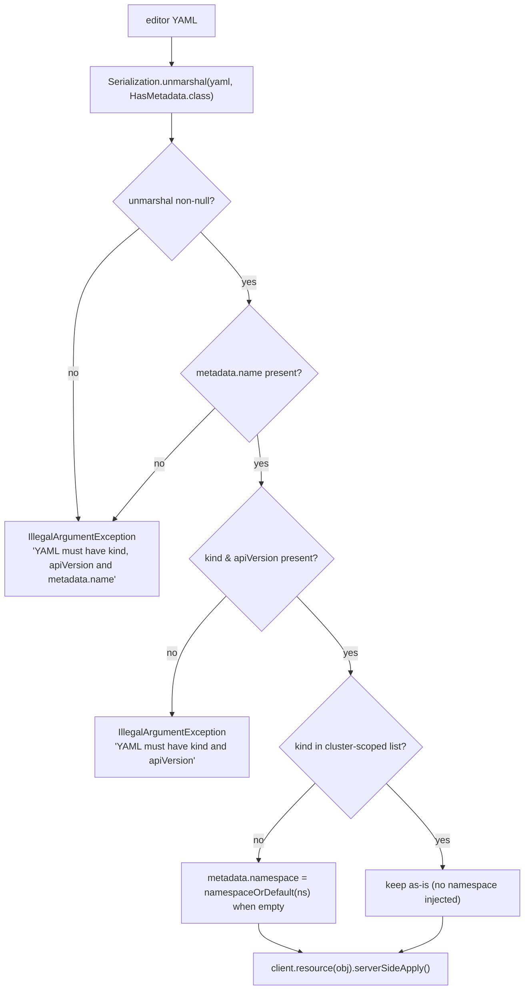

# Resource catalog

`ResourceKind` (`src/main/java/dev/jkubeterm/ResourceKind.java:3`) enumerates
the kinds JKubeTerm can browse, and `KubernetesService.list` maps each to a
typed Fabric8 DSL call (`KubernetesService.java:28`).

## 1. Browsable kinds

| Enum constant | Label | Scope | Fabric8 call |
|---|---|---|---|
| `PODS` | Pods | namespaced | `client.pods().inNamespace(ns).list()` |
| `DEPLOYMENTS` | Deployments | namespaced | `client.apps().deployments().inNamespace(ns).list()` |
| `STATEFUL_SETS` | StatefulSets | namespaced | `client.apps().statefulSets().inNamespace(ns).list()` |
| `DAEMON_SETS` | DaemonSets | namespaced | `client.apps().daemonSets().inNamespace(ns).list()` |
| `SERVICES` | Services | namespaced | `client.services().inNamespace(ns).list()` |
| `CONFIG_MAPS` | ConfigMaps | namespaced | `client.configMaps().inNamespace(ns).list()` |
| `JOBS` | Jobs | namespaced | `client.batch().v1().jobs().inNamespace(ns).list()` |
| `CRON_JOBS` | CronJobs | namespaced | `client.batch().v1().cronjobs().inNamespace(ns).list()` |
| `INGRESSES` | Ingresses | namespaced | `client.network().v1().ingresses().inNamespace(ns).list()` |
| `PERSISTENT_VOLUME_CLAIMS` | PVCs | namespaced | `client.persistentVolumeClaims().inNamespace(ns).list()` |
| `EVENTS` | Events | namespaced | `client.v1().events().inNamespace(ns).list()` |
| `NODES` | Nodes | cluster | `client.nodes().list()` |
| `NAMESPACES` | Namespaces | cluster | `client.namespaces().list()` |
| `PERSISTENT_VOLUMES` | PersistentVolumes | cluster | `client.persistentVolumes().list()` |

Notes:

- `list()` resolves the namespace via `namespaceOrDefault(ns)` → blank/null
  becomes `default`; the namespace is ignored for cluster-scoped kinds.
- `namespaced` flag on the enum mirrors where the kind can be listed; the
  *apply* path uses its own static list (below) because users may apply kinds
  that are not browsable.
- Listing `Namespaces`/`Nodes`/`PersistentVolumes` requires cluster-scope
  read RBAC; all other views need namespace-scope read.

## 2. Apply path (YAML → cluster)

### Cluster-scoped kinds used by apply

`isClusterScoped` (`KubernetesService.java:69`):

`Node`, `Namespace`, `PersistentVolume`, `ClusterRole`,
`ClusterRoleBinding`, `CustomResourceDefinition`, `StorageClass`

This is a pragmatic allowlist, not API discovery — unknown cluster-scoped
kinds would receive a defaulted namespace and fail server-side. API discovery
and a CRD browser are roadmap item 4.

### Table ↔ action applicability

| Action | Applicable selection |
|---|---|
| Pod logs / Exec command | `Pod` only |
| Port forward | `Pod` or `Service` |
| Scale / Restart | `Deployment` only |
| Apply YAML / New YAML | any (validated client-side as above) |
| Delete / Save YAML | any selected item |

## 3. YAML codec

| Direction | Call | Notes |
|---|---|---|
| Object → editor | `Serialization.asYaml(resource)` (`KubernetesService.java:47`) | Pure in-memory, runs on FX thread on row selection |
| Editor → object | `Serialization.unmarshal(yaml, HasMetadata.class)` (`KubernetesService.java:59`) | Fabric8's snakeyaml-backed codec; failures become `IllegalArgumentException` paths above |
| Export | `Files.writeString` of editor text (`JKubeTermApp.java:230`) | Local file only; can contain sensitive data — see [security](../operations/security.md) |

## 4. Operational semantics

| Operation | Server-side behaviour | Guard rails |
|---|---|---|
| `logs(ns, pod, container, tail)` | `tailingLines(max(1, tail)).getLog()` — last N lines, one-shot (not streaming) | Call site fixes tail = 500; non-Pod rejected in UI |
| `delete(resource)` | `client.resource(resource).delete()` | Confirmation dialog quoting kind/name/context |
| `apply(yaml, ns)` | **Server-side apply** (`serverSideApply()`) | Confirmation dialog; validation above; never triggered by merely loading a resource into the editor |
| `scaleDeployment(ns, name, replicas)` | `apps().deployments()…scale(replicas)` | Negative replicas rejected before confirm |
| `restartDeployment(ns, name)` | `edit()` adds pod-template annotation `kubectl.kubernetes.io/restartedAt = Instant.now()` (ISO-8601) — the kubectl rollout-restart idiom | Confirmation dialog; `IllegalStateException` if pod template missing |

## 5. UI presentation

- Table columns: **Name**, **Namespace**, **Kind**, **Created**
  (`metadata.getCreationTimestamp()`); null-safe `Optional.orElse("")` mapping
  (`JKubeTermApp.java:88`).
- Filter matches `metadata.name` case-insensitively after listing.
- Kind list shows the `label` via `toString()` (`ResourceKind.java:11`);
  `PODS` is pre-selected at startup.
