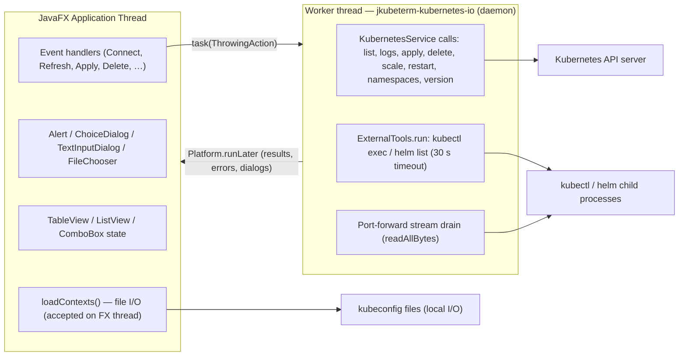
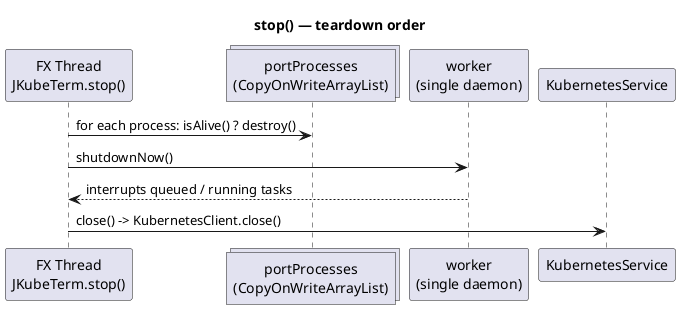
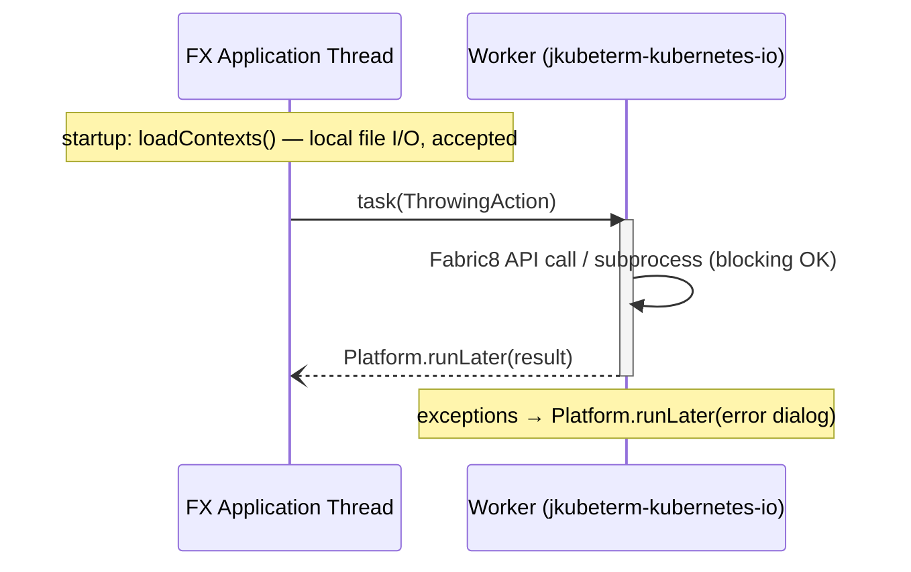

# Threading model

JKubeTerm uses exactly two threads that matter:

| Thread | Name | Role |
|---|---|---|
| JavaFX Application Thread | (JavaFX-managed) | Scene construction, all event handlers, dialogs, table/list/combobox updates |
| Single worker thread | `jkubeterm-kubernetes-io` (daemon) | Every blocking operation: Fabric8 API calls, kubectl/helm child processes, port-forward output drain |

The worker is created in `JKubeTermApp`
(`src/main/java/dev/jkubeterm/JKubeTermApp.java:24`):

```java
private final ExecutorService worker = Executors.newSingleThreadExecutor(r -> {
    Thread t = new Thread(r, "jkubeterm-kubernetes-io"); t.setDaemon(true); return t;
});
```

## Rules

1. **Never block the FX thread with network or process I/O.** All cluster and
   subprocess work goes through `task(ThrowingAction)` which does
   `worker.submit(...)` (`JKubeTermApp.java:235`).
2. **Never mutate scene graph state off the FX thread.** Worker results are
   published with `Platform.runLater(...)`; the worker lambdas capture only
   immutable inputs (kind, namespace, selected item, YAML text).
3. **Single-threaded on purpose.** One worker serialises Kubernetes operations,
   keeping result ordering deterministic (responses cannot interleave) and
   avoiding any need for locking on `service` / `currentItems`.
4. **Long-running child processes get a dedicated drain task.** The
   port-forward output reader runs on the same worker
   (`JKubeTermApp.java:196`), so a hung port-forward blocks subsequent queued
   tasks — accepted trade-off for a single-threaded design.
5. **Daemon thread.** Even if a task misbehaves, it cannot prevent JVM exit;
   `stop()` still forces `shutdownNow()`.

## The `task()` wrapper

```java
private void task(ThrowingAction action) {
    worker.submit(() -> {
        try { action.run(); }
        catch (Exception e) { Platform.runLater(() -> error("Kubernetes operation failed", e)); }
    });
}
```

- `ThrowingAction` is a local functional interface (`void run() throws Exception`).
- UI error surfacing is centralised here; individual flows only care about
  their happy path.
- Cancellation is *not* attempted mid-operation: `shutdownNow()` interrupts the
  thread at shutdown, but Fabric8/kubectl calls finish or fail on their own.

## Visual model



## Shutdown ordering (`stop()`)



Order matters: port-forward children are killed first so their drain tasks do
not linger; the executor is shut down before the client so no in-flight task
can use a closing client.

## Caveats

- **`loadContexts()` runs on the FX thread** (`start()` end and ↻ Config
  button). It reads local kubeconfig files with SnakeYAML. This is a small,
  bounded, local I/O cost; typical configs parse in milliseconds. Moving it to
  the worker would delay combo population and complicate the start sequence —
  intentionally not done in v0.1.0.
- **Port-forward `ProcessBuilder.start()` runs on the FX thread.** Process
  creation is a fast syscall; only output draining is offloaded to the worker.
- **`service.yaml(item)` runs on the FX thread** — it is pure in-memory
  serialization (Fabric8 `Serialization.asYaml`), no network.
- **Dialog interactions between phases** (logs: containers → ChoiceDialog →
  logs) hop worker → FX → worker, keeping every blocking segment on the worker.

## Mermaid thread-partition view


