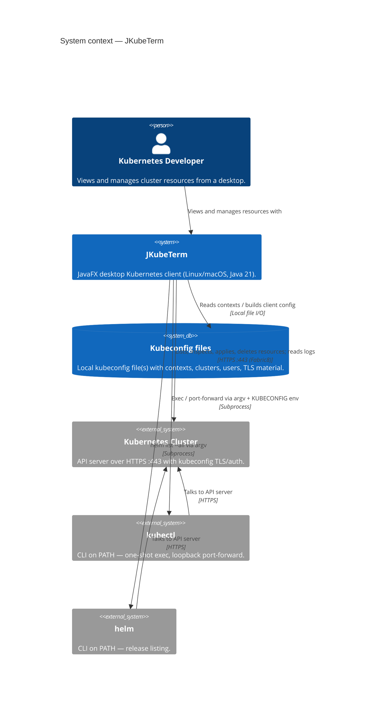
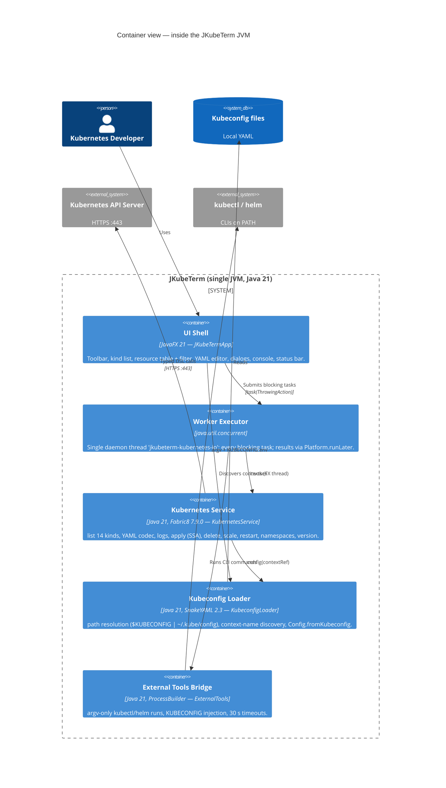
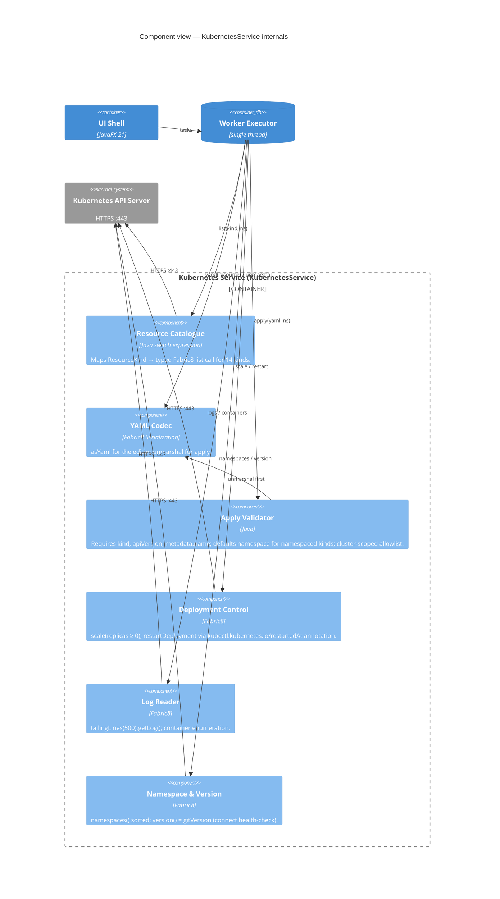
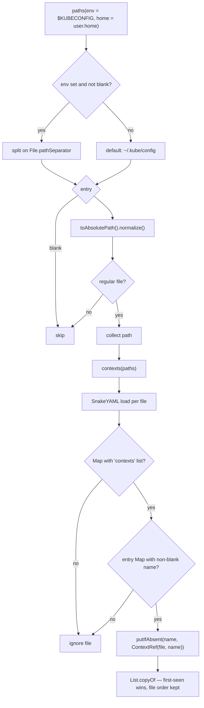
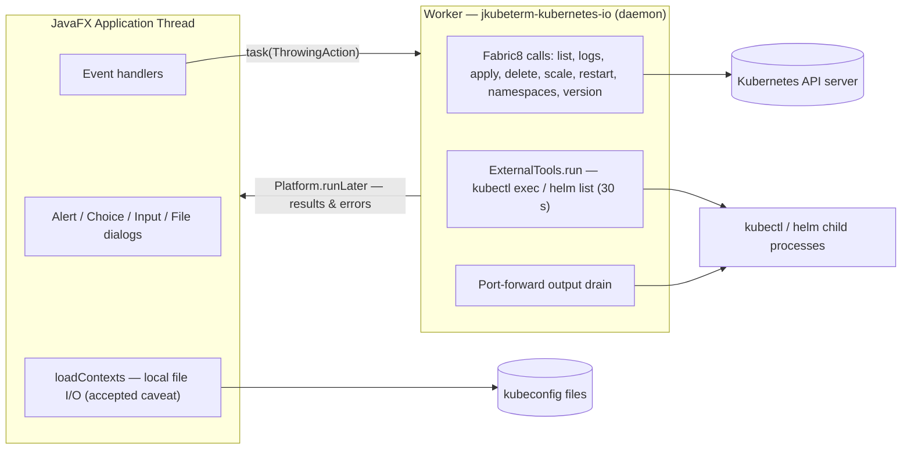
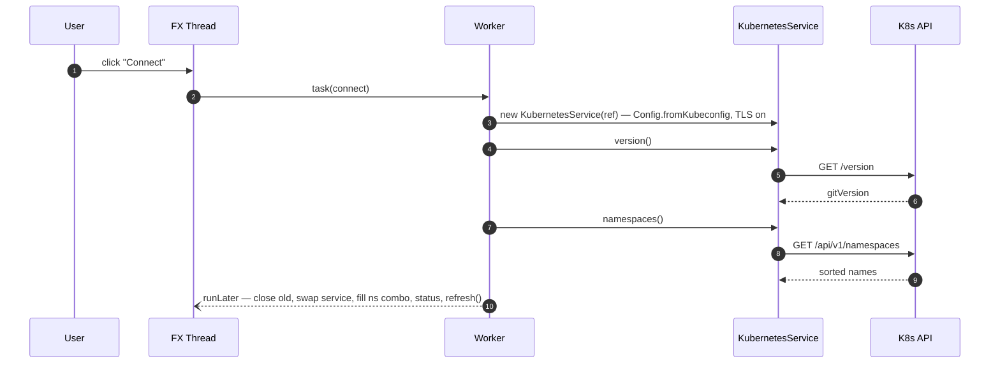
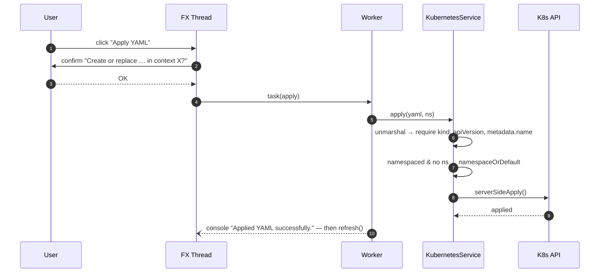
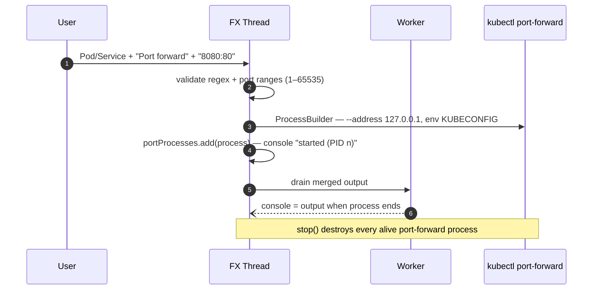
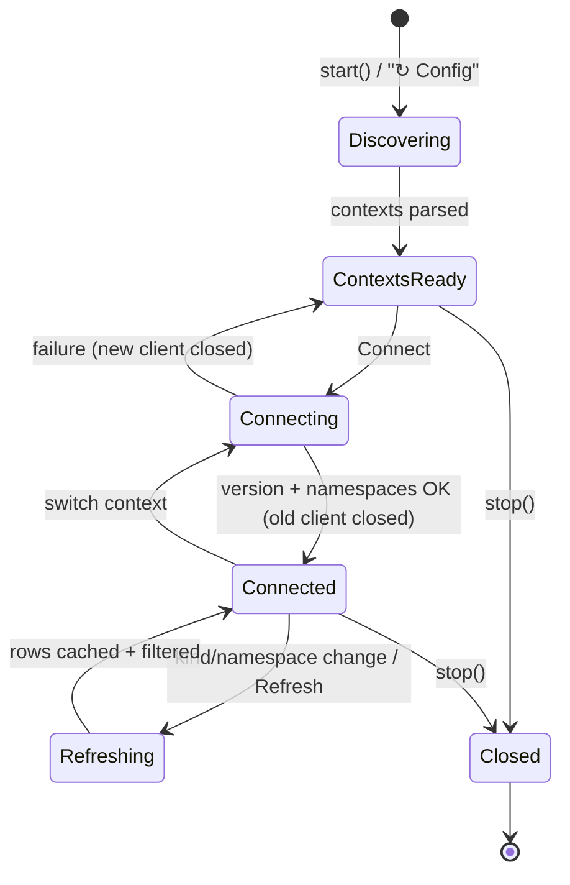
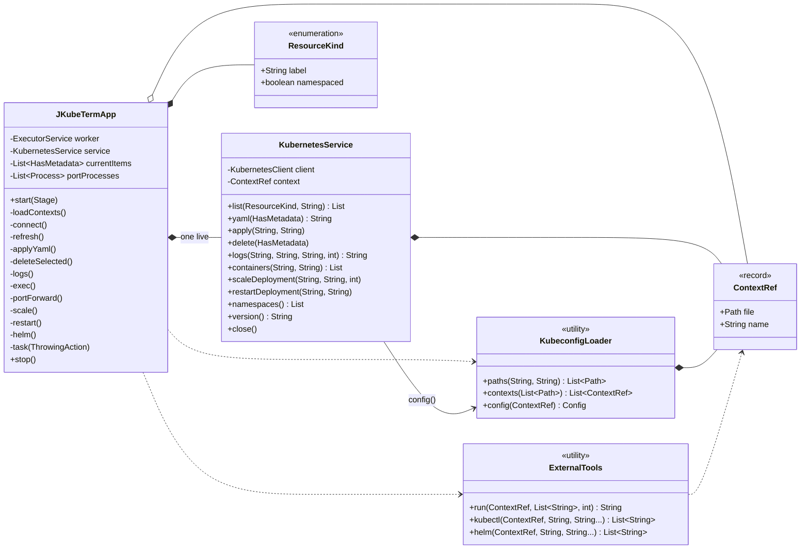

# Mermaid diagram sources

All Mermaid sources in one place. On this site they render automatically
(Mermaid 11 + `pymdownx.superfences`). Equivalent PlantUML sources:
[plantuml.md](plantuml.md).

## 1. System context (C4 level 1)

## 2. Container view (C4 level 2)

## 3. Component view — Kubernetes Service internals (C4 level 3)

## 4. Kubeconfig discovery flow

## 5. Threading model

## 6. Sequence — connect

## 7. Sequence — apply YAML (server-side apply)

## 8. Sequence — port-forward lifecycle

## 9. State connection lifecycle

## 10. Class diagram

