# PlantUML diagram sources

Complete PlantUML source set. Every diagram below renders as an inline SVG
preview via the local PlantUML server in Docker (`docker compose up -d`
→ `http://localhost:8080`; images embedded as base64, offline-readable).
The original sources remain editable as text after each preview. Equivalent
Mermaid sources: [mermaid.md](mermaid.md); ArchiMate modelling:
[archi.md](archi.md).

## 1. System context (C4 level 1)

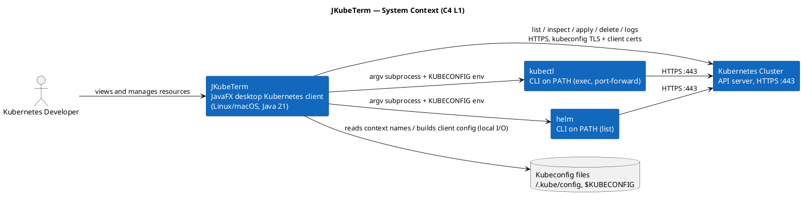

## 2. Container / component view (C4 level 2)

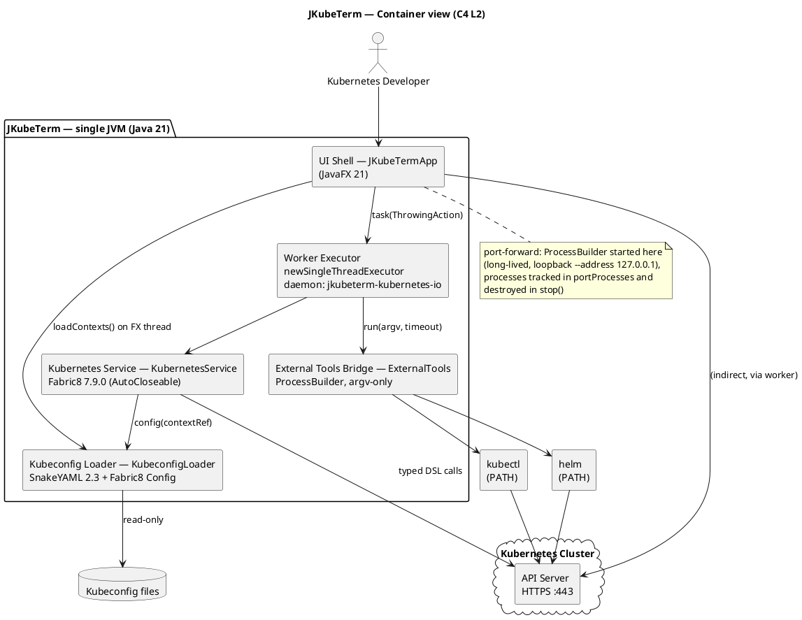

## 3. Kubernetes Service internals (C4 level 3)

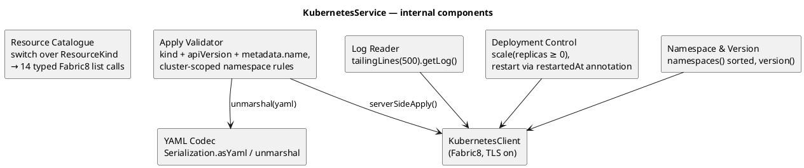

## 4. Class diagram

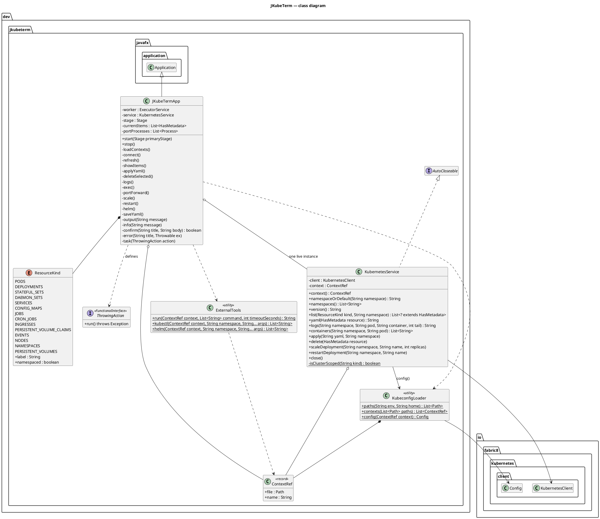

## 5. Sequence diagrams

### 5.1 Connect to a context

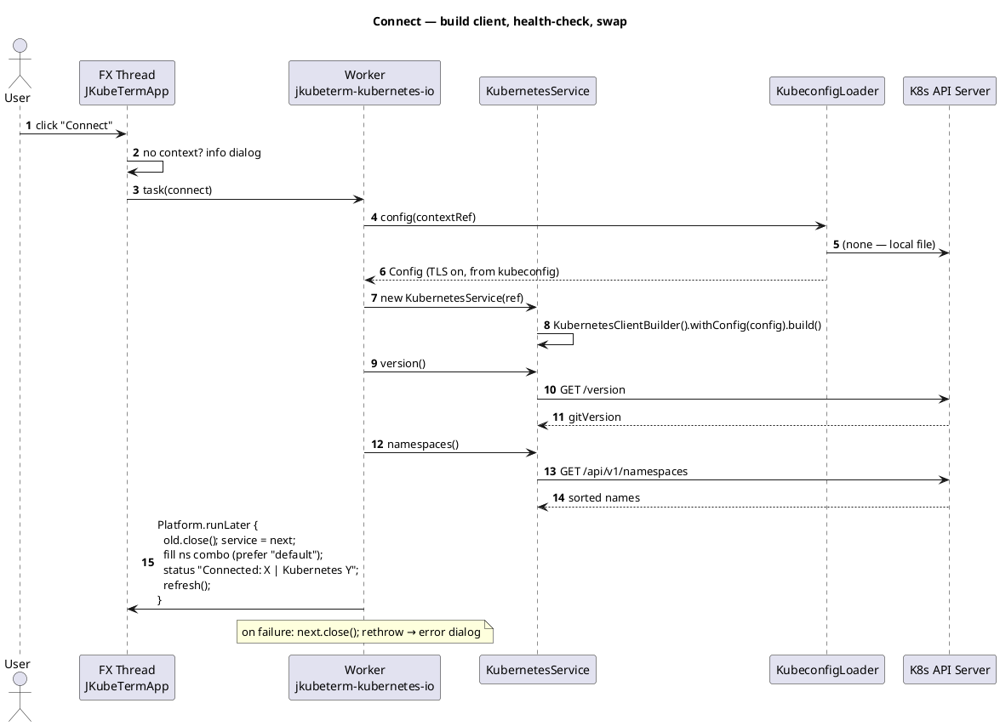

### 5.2 Browse / refresh

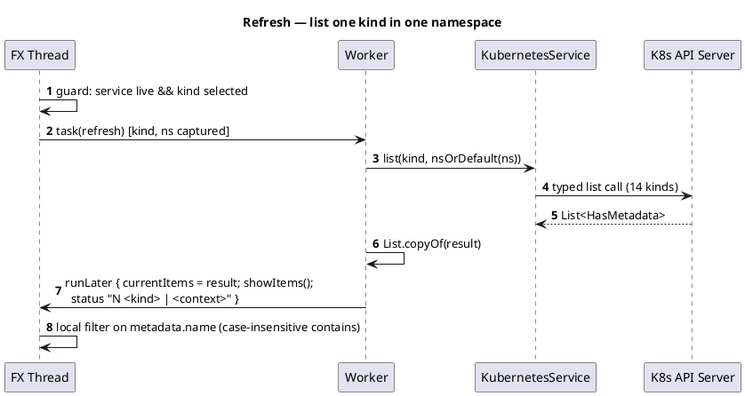

### 5.3 Apply YAML

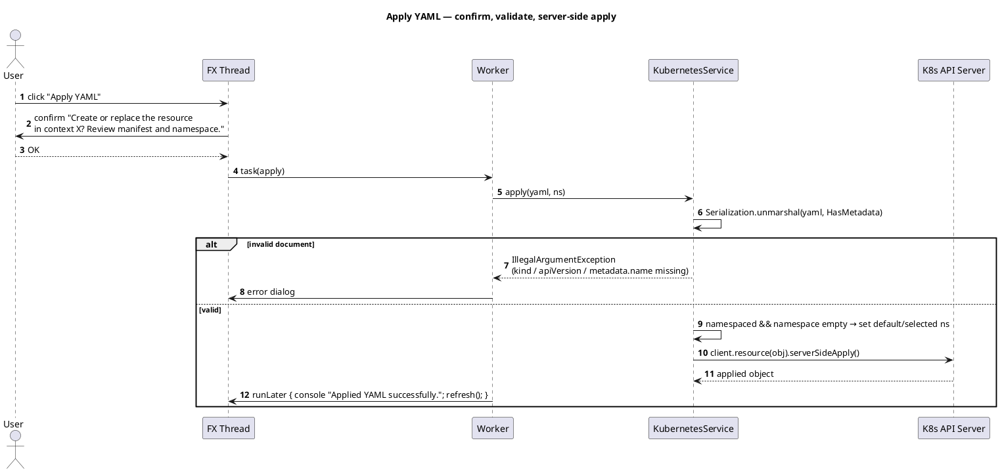

### 5.4 Pod logs (container choice)

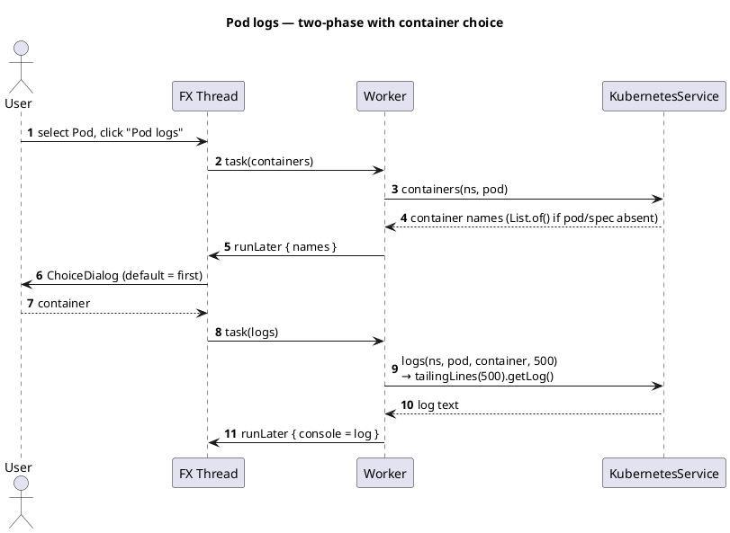

### 5.5 Port-forward lifecycle

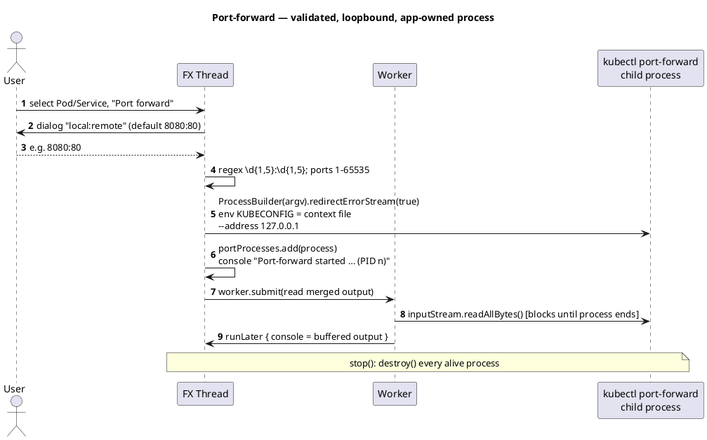

## 6. State machine — connection lifecycle

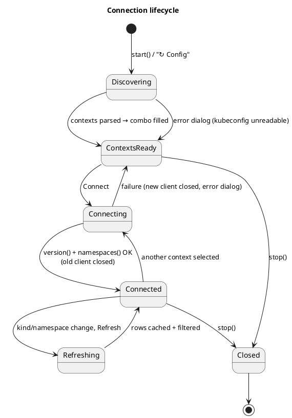

## 7. Deployment diagram

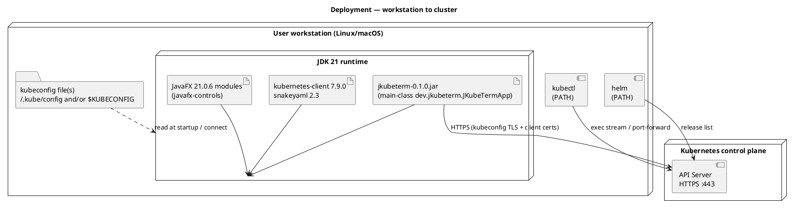

## 8. Activity — kubeconfig discovery

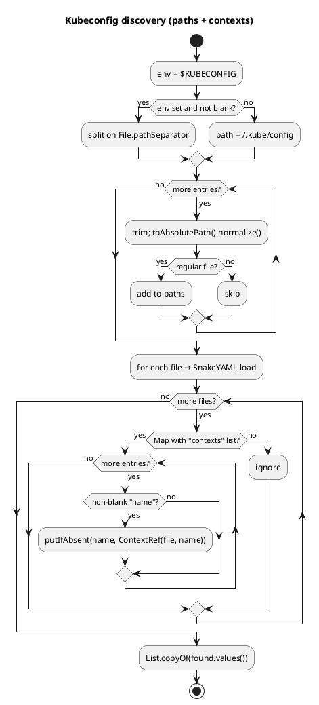

## 9. Threading — FX thread vs. worker

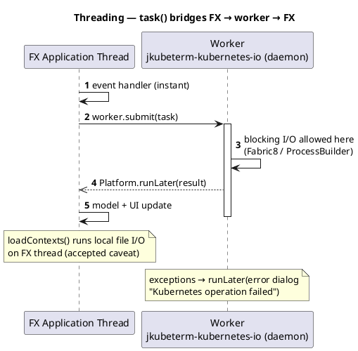

## 10. ArchiMate rendering (application structure)

Rendered with PlantUML's ArchiMate standard library (modern PlantUML moved
ArchiMate into the stdlib) — the same model that is exchangeable with the
Archi tool, see [archi.md](archi.md). Note: this block also gets a preview
from the local server; `!include <archimate/Archimate>` is resolved by the
server-side stdlib, so no local include path is needed.

```plantuml
@startuml
!include <archimate/Archimate>
title ArchiMate — JKubeTerm application structure

Business_Actor(user, "Kubernetes Developer", "uses JKubeTerm on a workstation")
Application_Component(jkt, "JKubeTerm", "desktop JavaFX client")
Application_Component(ui, "UI Shell (JKubeTermApp)", "scene, dialogs, event wiring")
Application_Component(worker, "Worker Executor", "single daemon thread")
Application_Component(svc, "Kubernetes Service", "Fabric8 wrapper")
Application_Component(kl, "Kubeconfig Loader", "SnakeYAML + Fabric8 Config")
Application_Component(bridge, "External Tools Bridge", "argv-only subprocesses")
Application_Service(s1, "Resource Browsing Service", "")
Application_Service(s2, "Manifest Management Service", "")
Application_Service(s3, "Log / Exec / CLI Integration", "")
Application_Service(s4, "Deployment Control Service", "")
Application_Service(s5, "Context Discovery Service", "")
Application_DataObject(kc, "Kubeconfig files", "local YAML")
Application_DataObject(y, "Resource YAML", "editor / export")
Technology_Node(k8s, "Kubernetes Cluster", "API Server HTTPS :443")

Rel_Assignment(user, jkt, "uses")
Rel_Composition(jkt, ui)
Rel_Composition(jkt, worker)
Rel_Composition(jkt, svc)
Rel_Composition(jkt, kl)
Rel_Composition(jkt, bridge)
Rel_Serving(s1, ui)
Rel_Serving(s2, ui)
Rel_Serving(s3, ui)
Rel_Serving(s4, ui)
Rel_Serving(s5, ui)
Rel_Realization(svc, s1)
Rel_Realization(svc, s2)
Rel_Realization(svc, s3)
Rel_Realization(svc, s4)
Rel_Realization(kl, s5)
Rel_Triggering(ui, worker, "task(ThrowingAction)")
Rel_Access(kl, kc, "read (discovery)")
Rel_Access(svc, kc, "read (Config.fromKubeconfig)")
Rel_Access(svc, y, "read/write (editor, apply, export)")
Rel_Flow(svc, k8s, "HTTPS :443 (kubeconfig TLS)")
Rel_Flow(bridge, k8s, "via kubectl / helm")
@enduml
```

## 11. UX state machine — connection lifecycle plus edit mode and action flows

Source file: `ux-state-machine.puml` in this directory (validated with
`plantuml -checkonly`). State names match the Mermaid connection lifecycle in
[data-flow.md](../architecture/data-flow.md#0-connection-lifecycle-state-machine)
and [mermaid.md](mermaid.md#9-state-connection-lifecycle).

```plantuml
@startuml
title JKubeTerm — UX state machine (connection lifecycle + edit mode + action flows)

[*] --> Discovering : start() / "Config" button
Discovering --> ContextsReady : contexts parsed\ncombo filled
Discovering --> ContextsReady : kubeconfig unreadable\nerror dialog
ContextsReady --> Connecting : Connect
Connecting --> Connected : version() + namespaces() OK\nold client closed
Connecting --> ContextsReady : failure\nnew client closed\nerror dialog
Connected --> Connecting : another Connect
ContextsReady --> Closed : stop()
Connected --> Closed : stop()\nkill PF / shutdownNow / close()
Closed --> [*]

state Connected {
  [*] --> Browsing
  Browsing --> Refreshing : kind or namespace change\nRefresh click
  Refreshing --> Browsing : list() OK\nrows cached + filtered
  Browsing --> EditOn : tick Edit YAML\nNew YAML seeds ConfigMap template
  EditOn --> Browsing : row selected\neditMode off + editable false
  Browsing --> ConfirmDialog : Apply YAML\nDelete\nScale OK\nRestart
  ConfirmDialog --> Browsing : Cancel\nno side effect
  ConfirmDialog --> Applying : OK Apply
  ConfirmDialog --> Deleting : OK Delete
  ConfirmDialog --> Scaling : OK Scale
  ConfirmDialog --> Restarting : OK Restart
  Applying --> Refreshing : applied\nconsole + refresh()
  Deleting --> Refreshing : delete submitted\nconsole + refresh()
  Scaling --> Refreshing : scaleDeployment()\nrefresh()
  Restarting --> Refreshing : restartDeployment()\nrefresh()
  Browsing --> LogsDialog : Pod logs\ncontainers() on worker
  LogsDialog --> Logging : container chosen
  LogsDialog --> Browsing : Cancel or empty
  Logging --> Browsing : logs 500 lines\nconsole = log
  Browsing --> ExecDialog : Exec command\nPod selected
  ExecDialog --> ExecRunning : executable entered\nkubectl exec 30s
  ExecDialog --> Browsing : Cancel or blank
  ExecRunning --> Browsing : console = output
  Browsing --> PortForwardDialog : Port forward\nPod or Service selected
  PortForwardDialog --> PortForwardRunning : valid local:remote\nProcessBuilder.start() on FX thread
  PortForwardDialog --> Browsing : Cancel
  PortForwardDialog --> InfoDialog : regex or range fail
  PortForwardRunning --> Browsing : output shown on process end\nprocess tracked until stop()
  Browsing --> ScaleDialog : Scale\nDeployment selected
  ScaleDialog --> ConfirmDialog : n >= 0\nconfirm scale to n
  ScaleDialog --> Browsing : Cancel
  ScaleDialog --> InfoDialog : negative or non-integer
  Browsing --> HelmRunning : Helm releases\nhelm list 30s
  HelmRunning --> Browsing : console = release table
  Browsing --> SaveDialog : Save YAML\nFileChooser resource.yaml
  SaveDialog --> Browsing : saved or Cancel\nlocal only, no worker
  Browsing --> InfoDialog : non-Pod for logs or exec\nnon-Deployment for scale or restart\nnon-Pod-Service for port-forward
  InfoDialog --> Browsing : OK
}

note bottom of Connected
  Threading: Fabric8 and CLI blocking work via
  task() on jkubeterm-kubernetes-io worker.
  UI updates only via Platform.runLater.
  loadContexts(), service.yaml() and
  ProcessBuilder.start() run on FX thread.
end note

note bottom of PortForwardRunning
  portProcesses tracks live processes.
  stop() destroys alive processes before
  worker.shutdownNow() + service.close().
end note

note bottom of ConfirmDialog
  Mutating actions always go
  Connected -> ConfirmDialog -> action
  -> refresh() -> Connected.
end note

note bottom of LogsDialog
  Two-phase worker to FX to worker:
  containers() -> ChoiceDialog
  -> logs 500 lines.
end note
@enduml
```
