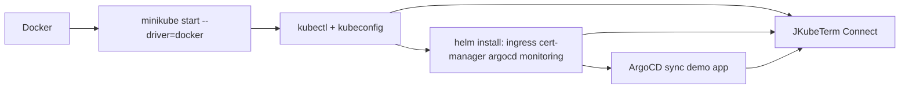

# QuickStart — домашняя лаборатория: minikube (docker) + JKubeTerm

> **PDF:** [quickstart-minikube.pdf](quickstart-minikube.pdf) — печать этой страницы
> (кнопка доступна после `tools/export-guides-pdf.sh`).

Цель: с нуля поднять одноузловой кластер на `minikube --driver=docker`
и настроить «новомодный» стек домашней лаборатории, управляя им через JKubeTerm.
Время: 45–90 минут. Проверено на связке minikube v1.39.0 / Kubernetes v1.37 / ArgoCD v3.4.8 /
`kube-prometheus-stack` 91.x / Dashboard 7.14.0.

Что получится:

| Слой | Компонент | Namespace |
|---|---|---|
| Кластер | minikube (docker driver, containerd) | — |
| Сеть | ingress-nginx + cert-manager (self-signed / staging) | `ingress-nginx`, `cert-manager` |
| GitOps | ArgoCD | `argocd` |
| Мониторинг | kube-prometheus-stack (Prometheus + Grafana) + metrics-server | `monitoring` |
| UI | Headlamp (рекомендуется) или Dashboard 7.14.0 (архивный) | `headlamp` или `kubernetes-dashboard` |
| Демо | podinfo через ArgoCD | `demo` |

Как JKubeTerm вписывается: установка выполняется в терминале (`kubectl`/`helm`),
а проверка, просмотр YAML, логи, exec, port-forward и `helm list` — в JKubeTerm.
JKubeTerm не ставит чарты (`helm list` только, `JKubeTermApp.java:220`) —
это осознанное ограничение, см. [external-tools](../architecture/external-tools.md).



## Требования {#requirements}

| Ресурс | Минимум | Рекомендуется для полного стека |
|---|---|---|
| CPU | 2 | 4–6 (`--cpus=4`) |
| RAM | 4 GB | 8–12 GB (`--memory=8192`) |
| Диск | 20 GB свободно | 40 GB (`--disk-size=40g`) |
| ОС | Linux или macOS (графическая сессия для JKubeTerm) | та же |
| Docker | запущенный daemon | тот же |

Установите CLI до старта:

```bash
# Docker: https://docs.docker.com/get-docker/ — убедитесь что docker info работает
docker info --format '{{.ServerVersion}}'

# kubectl — ставьте под версию кластера (v1.37 на сентябрь 2026)
curl -LO "https://dl.k8s.io/release/v1.37.0/bin/linux/amd64/kubectl"
sudo install -m 755 kubectl /usr/local/bin/kubectl
# macOS: brew install kubectl

# helm 3.16+
curl -fsSL -o get_helm.sh https://raw.githubusercontent.com/helm/helm/main/scripts/get-helm-3
chmod 700 get_helm.sh && ./get_helm.sh
# macOS: brew install helm

# minikube v1.39.0+
curl -LO https://storage.googleapis.com/minikube/releases/latest/minikube-linux-amd64
sudo install -m 755 minikube-linux-amd64 /usr/local/bin/minikube
# macOS: brew install minikube

# JKubeTerm (Java 21 + Maven 3.9+)
mvn -v
mvn clean javafx:run
```

`kubectl`/`helm` обязаны быть на `PATH` — иначе Exec/Port-forward/Helm в JKubeTerm
покажут ошибку запуска процесса, см. [external-tools](../architecture/external-tools.md#5-failure-surface).

## Старт кластера {#cluster-start}

```bash
minikube start --driver=docker --cpus=4 --memory=8192 --disk-size=40g
# явная версия при необходимости:
# minikube start --driver=docker --kubernetes-version=v1.37.0 --cpus=4 --memory=8192

minikube status
kubectl cluster-info
kubectl get nodes -o wide
```

Что происходит: minikube создаёт контекст `minikube` в `~/.kube/config`.
JKubeTerm находит его через `KubeconfigLoader.paths()` (`~/.kube/config` по умолчанию,
или `$KUBECONFIG` через разделитель путей), см. [kubeconfig](../architecture/kubeconfig.md).

Типовые проблемы:

| Симптом | Лечение |
|---|---|
| `DRV_AS_ROOT` под root | добавьте `--force` (только серверы/CI) либо заведите непривилегированного пользователя в группе `docker` |
| `Cannot connect to the Docker daemon` | запустите Docker Desktop / `sudo systemctl start docker`, проверьте `docker info` |
| Не хватает RAM под полный стек | стартуйте с `--memory=6144` и ставьте компоненты по очереди, либо уберите Dashboard |

## Подключение JKubeTerm {#jkubeterm-connect}

1. Запустите JKubeTerm (`mvn clean javafx:run`).
2. Вверху: комбо **Context** → выберите `minikube  [config]` → **Connect**.
   Статус должен показать `Connected: minikube | Kubernetes v1.37.x` (`JKubeTermApp.java:103`).
3. Комбо **Namespace** → `default`. Слева выберите **Pods** → **Refresh**.
4. Проверьте кластерные виды: **Nodes**, **Namespaces**, **PersistentVolumes** —
   им нужен cluster-scope read RBAC (у minikube admin он есть).

Если контекст не появился: **↻ Config** перечитывает файлы (`loadContexts`,
`JKubeTermApp.java:93`). Проверьте `kubectl config get-contexts` и права на `~/.kube/config`.

## Базовые аддоны minikube {#minikube-addons}

```bash
minikube addons enable ingress
minikube addons enable metrics-server
minikube addons enable storage-provisioner
kubectl -n ingress-nginx get pods
kubectl -n kube-system get pods -l k8s-app=metrics-server
```

Проверка в JKubeTerm: Namespace `ingress-nginx` → **Deployments** → `ingress-nginx-controller`;
**Services** → `ingress-nginx-controller`; выберите Pod → **Pod logs** (хвост 500 строк,
`KubernetesService.java:48`).

> Для домашней лаборатории ставьте либо аддон `ingress`, либо Helm-релиз
> `ingress-nginx` из шага 4 — не оба сразу, иначе будет конфликт портов/классов.

## Платформенный стек через Helm {#platform-stack}

Добавьте репозитории один раз:

```bash
helm repo add ingress-nginx https://kubernetes.github.io/ingress-nginx
helm repo add jetstack https://charts.jetstack.io
helm repo add argo https://argoproj.github.io/argo-helm
helm repo add prometheus-community https://prometheus-community.github.io/helm-charts
helm repo add headlamp https://kubernetes-sigs.github.io/headlamp/
helm repo update
```

### 4.1 cert-manager (нужен Dashboard 7.x и TLS Ingress)

```bash
helm upgrade --install cert-manager jetstack/cert-manager \
  --namespace cert-manager --create-namespace \
  --set crds.enabled=true
kubectl -n cert-manager wait --for=condition=available deploy --all --timeout=180s
```

### 4.2 ingress-nginx (если не использовали аддон из шага 3)

```bash
helm upgrade --install ingress-nginx ingress-nginx/ingress-nginx \
  --namespace ingress-nginx --create-namespace
kubectl -n ingress-nginx get svc ingress-nginx-controller
```

В JKubeTerm: **Ingresses** появится в списке видов только когда есть объекты
этого kind; отсутствие таблицы — это пустой листинг, а не ошибка.

### 4.3 ArgoCD v3.4.8

```bash
kubectl create namespace argocd
kubectl apply -n argocd --server-side --force-conflicts \
  -f https://raw.githubusercontent.com/argoproj/argo-cd/v3.4.8/manifests/install.yaml
kubectl -n argocd rollout status deploy/argocd-server --timeout=300s
# начальный пароль admin:
kubectl -n argocd get secret argocd-initial-admin-secret -o jsonpath='{.data.password}' | base64 -d; echo
```

Доступ локально через JKubeTerm (loopback, `JKubeTermApp.java:180`):

1. В JKubeTerm: Namespace `argocd` → **Services** → `argocd-server` → **Port forward** → `8080:80`.
2. Откройте `http://127.0.0.1:8080`, логин `admin` + пароль из секрета.
3. Форвард живёт пока живёт JKubeTerm (`stop()` гасит процессы, `JKubeTermApp.java:237`).
   Кнопки «остановить» нет — это ограничение roadmap-3.

Проверка в JKubeTerm: **Deployments** в `argocd` (`argocd-server`, `argocd-repo-server`,
`argocd-application-controller`), **Services** (`argocd-server`), логи Pod через
двухфазный диалог выбора контейнера (`JKubeTermApp.java:152`).

### 4.4 kube-prometheus-stack 91.x (Prometheus + Grafana)

Тяжёлый чарт для minikube — ставьте после ArgoCD:

```bash
helm upgrade --install monitoring prometheus-community/kube-prometheus-stack \
  --namespace monitoring --create-namespace \
  --set grafana.adminPassword=admin123 \
  --set prometheus.prometheusSpec.retention=7d
kubectl -n monitoring get pods
```

Доступ:

```bash
# вариант A — kubectl (терминал):
kubectl -n monitoring port-forward svc/monitoring-grafana 3000:80
# вариант B — JKubeTerm: Services → monitoring-grafana → Port forward → 3000:80
```

Откройте `http://127.0.0.1:3000` (admin/admin123). В JKubeTerm заодно посмотрите
**ConfigMaps** (дашборды Grafana) и **PersistentVolumeClaims** (хранение Prometheus).

Если minikube задыхается: `--set prometheus.prometheusSpec.retention=3d`,
отключите часть экспортеров или поднимите `--memory=12288` пересозданием профиля.

### 4.5 Web UI: Headlamp (рекомендуется) или Dashboard 7.14.0 (архив)

Upstream Dashboard архивирован в январе 2026, Helm-репо `kubernetes.github.io/dashboard`
возвращает 404. Рабочий путь — `kubernetes-retired.github.io/dashboard`, но для новых
установок проект Kubernetes рекомендует Headlamp.

```bash
# Headlamp:
helm upgrade --install headlamp headlamp/headlamp --namespace headlamp --create-namespace
kubectl -n headlamp get pods

# Либо Dashboard 7.14.0 (последний релиз октября 2025, только если он вам нужен):
helm repo add kubernetes-dashboard https://kubernetes-retired.github.io/dashboard/
helm repo update
helm upgrade --install kubernetes-dashboard kubernetes-dashboard/kubernetes-dashboard \
  --namespace kubernetes-dashboard --create-namespace
```

Доступ — только через port-forward + токен ServiceAccount (не выставляйте
Dashboard в интернет без auth-прокси, см. [admin-guide](admin-guide.md)).

## Первое демо-приложение {#demo-app}

Вариант A — напрямую через JKubeTerm (проверка Apply):

1. **New YAML** → вставьте Deployment+Service `podinfo`/`nginx` в `demo` →
   **Apply YAML** → подтвердите контекст (`JKubeTermApp.java:141`).
   Валидация требует `kind`, `apiVersion`, `metadata.name`; namespace подставится
   из комбо, если пуст (`KubernetesService.java:58`).
2. **Deployments** в `demo` → выберите → **Scale** → `3` → confirm.
3. **Services** → port-forward `8080:80` → проверьте в браузере.

Вариант B — через ArgoCD (GitOps-путь, рекомендуется для лаборатории):

```yaml
# noinspection KubernetesUnknownResourcesInspection
apiVersion: argoproj.io/v1alpha1
# noinspection KubernetesUnknownResourcesInspection
kind: Application
metadata:
  name: podinfo
  namespace: argocd
spec:
  project: default
  source:
    repoURL: https://github.com/stefanprodan/podinfo
    targetRevision: HEAD
    path: charts/podinfo
  destination:
    server: https://kubernetes.default.svc
    namespace: demo
  syncPolicy:
    automated: { prune: true, selfHeal: true }
    syncOptions: [CreateNamespace=true]
```

```bash
kubectl apply -f argocd-demo-app.yaml
kubectl -n argocd get application podinfo
```

Наблюдение в JKubeTerm: Namespace `demo` → **Pods**/**Deployments**/**Services** →
таблица + фильтр по имени; **Events** подскажет причину CrashLoop; **Pod logs**
покажет последние 500 строк.

## Access map

| Сервис | Namespace / Service | Port-forward через JKubeTerm | URL |
|---|---|---|---|
| ArgoCD | `argocd` / `argocd-server` | `8080:80` | `http://127.0.0.1:8080` |
| Grafana | `monitoring` / `monitoring-grafana` | `3000:80` | `http://127.0.0.1:3000` |
| Prometheus | `monitoring` / `monitoring-kube-prometheus-prometheus` | `9090:9090` | `http://127.0.0.1:9090` |
| Headlamp | `headlamp` / `headlamp` | `3001:80` | `http://127.0.0.1:3001` |
| Demo | `demo` / ваш Service | `8080:80` | `http://127.0.0.1:8080` |

Правила JKubeTerm для форвардов: формат `local:remote`, порты 1–65535,
биндинг только `127.0.0.1`, процесс на FX-потоке, вывод — на worker
(`JKubeTermApp.java:180`, [external-tools](../architecture/external-tools.md#3-port-forward-special-case)).

## Повседневные команды minikube {#daily-minikube}

```bash
minikube pause              # заморозить без удаления (экономия CPU)
minikube unpause
minikube stop               # остановить ВМ/контейнер, данные сохраняются
minikube start              # перезапуск после reboot хоста
minikube service -n demo <svc> --url   # NodePort-URL без Ingress
minikube tunnel             # LoadBalancer-тип в отдельном терминале (нужен root)
minikube dashboard          # встроенный дашборд minikube (не путать с k8s Dashboard 7.x)
minikube delete             # ПОЛНОЕ удаление лаборатории
```

## Диагностика из JKubeTerm {#diagnostics}

| Задача | Действие в JKubeTerm |
|---|---|
| Упавший Pod | **Pods** → фильтр → **Pod logs** (выбор контейнера) → **Events** в том же namespace |
| Нужна shell-команда | **Exec command** — один executable (`/bin/sh`), без shell-парсинга, 30 с таймаут |
| Список релизов Helm | **Helm releases** — `helm list` в выбранном namespace (установки/откаты — только CLI) |
| Правка манифеста | строка → YAML справа → **Edit YAML** → **Apply YAML** (server-side apply) |
| Экспорт | **Save YAML…** в `resource.yaml` (локально, осторожно с секретами) |

Ошибки `CERTIFICATE_VERIFY_FAILED`, таймауты CLI и отсутствие бинарей —
см. [user-guide](user-guide.md) и [security](../operations/security.md).

## Далее {#next}

- [Руководство пользователя](user-guide.md) — все кнопки и диалоги JKubeTerm.
- [Руководство администратора](admin-guide.md) — RBAC, GitOps-структура,
  hardening, бэкапы, апгрейды и зачистка лаборатории.
