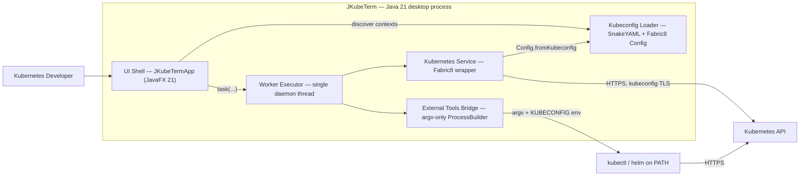

# JKubeTerm — Architecture Documentation

Detailed architectural documentation for **JKubeTerm 0.1.0**, a cross-platform
JavaFX desktop Kubernetes client for Linux and macOS, written in Java 21 and
built on the [Fabric8](https://github.com/fabric8io/kubernetes-client)
Kubernetes client.

This site is the single source of truth for how JKubeTerm is structured,
how its runtime flows work, and which trade-offs were made. The same model is
expressed in four notations so it can be consumed by both tools and humans:

| Notation | Primary use in this site | Entry point |
|---|---|---|
| **Mermaid** | Diagrams rendered inline on every page (C4, sequence, state, flow) | [diagrams/mermaid.md](diagrams/mermaid.md) |
| **PlantUML** | Detailed UML sources (component, class, sequence, state, deployment, activity) + ArchiMate rendering | [diagrams/plantuml.md](diagrams/plantuml.md) |
| **Archi / ArchiMate** | Enterprise-style model exchange file (`.archi`) for the Archi tool | [diagrams/archi.md](diagrams/archi.md) |
| **Structurizr (C4 DSL)** | Model-as-code C4 workspace for structurizr.com / Structurizr CLI | [diagrams/structurizr.md](diagrams/structurizr.md) |

## System at a glance



## Quick facts

| Aspect | Value |
|---|---|
| Language / runtime | Java 21 (`maven.compiler.release=21`) |
| UI toolkit | JavaFX / OpenJFX `javafx-controls` 21.0.6 |
| Kubernetes client | `io.fabric8:kubernetes-client` 7.9.0 |
| YAML parsing | SnakeYAML 2.3 (context discovery), Fabric8 `Serialization` (resource YAML) |
| Tests | JUnit Jupiter 5.11.4 |
| Build | Apache Maven 3.9+, `javafx-maven-plugin` 0.0.8, `jpackage` for native images |
| Platforms | Linux, macOS (desktop graphical session required) |
| Backend service | **None** — all credentials and connections stay on the workstation |

## Documentation map

- **UI Wireframe** — interactive `draw.io` mockup (`docs/ui-wireframe.drawio`) with clickable links connecting each UI element to architecture docs (`docs/ui-wireframe.md`)
- **Architecture**
  - [Overview](architecture/overview.md) — scope, principles, context view, stack
  - [Components & modules](architecture/components.md) — every class, its API and collaborators
  - [Data flow & sequences](architecture/data-flow.md) — all runtime flows end-to-end
  - [Threading model](architecture/threading.md) — FX thread vs. worker executor rules
  - [Kubeconfig & authentication](architecture/kubeconfig.md) — discovery, parsing, TLS
  - [External tool integration](architecture/external-tools.md) — kubectl exec / port-forward / helm
  - [Resource catalog](architecture/resources.md) — the 14 supported kinds and their Fabric8 calls
  - [Architecture decisions](architecture/decisions.md) — ADR-0001 … ADR-0008
- **Diagrams** — [notation guide](diagrams/index.md) plus consolidated
  [PlantUML](diagrams/plantuml.md), [Mermaid](diagrams/mermaid.md),
  [Archi/ArchiMate](diagrams/archi.md) and [Structurizr C4](diagrams/structurizr.md) sources
- **Development** — [build & packaging](development/build.md), [testing](development/testing.md)
- **Operations** — [security](operations/security.md), [roadmap](operations/roadmap.md)
- **Guides** — [QuickStart: minikube home lab](guides/quickstart-minikube.md),
  [user guide](guides/user-guide.md), [admin guide](guides/admin-guide.md)
  (each guide offers a printable PDF via `tools/export-guides-pdf.sh`)
- **Training** — [course map](training/index.md): 12 модулей от Pod'а до
  GitOps-стека с проверкой каждого шага в JKubeTerm (PDF на модуль через
  `tools/export-training-pdf.sh`)

## Building this documentation

```bash
python3 -m pip install -r requirements-docs.txt
docker compose up -d          # local PlantUML server at http://localhost:8080
mkdocs serve   # live preview at http://127.0.0.1:8000
mkdocs build   # static site in site/
```

Mermaid diagrams render in the browser (Mermaid 11 is loaded from a CDN).
PlantUML diagrams on [diagrams/plantuml.md](diagrams/plantuml.md) render as
inline SVG previews via the local PlantUML server (`docker compose up -d`
→ `http://localhost:8080`); sources stay editable as text after each preview.
