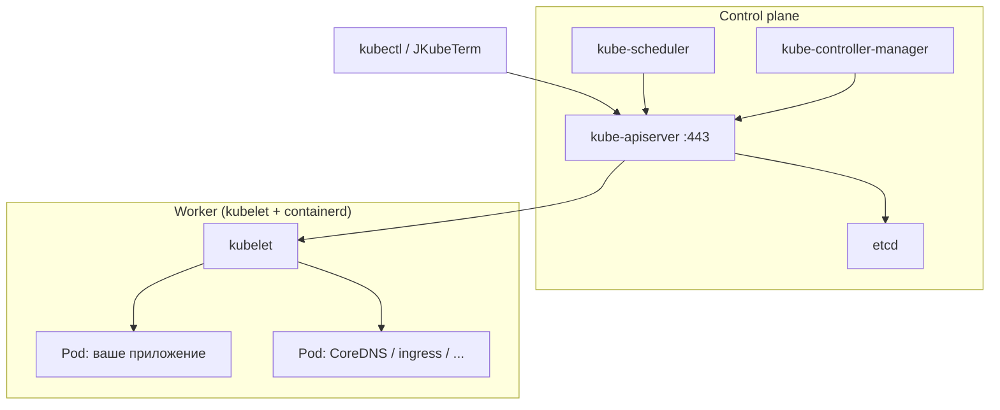
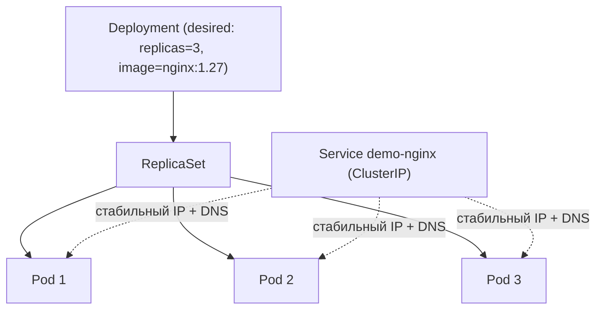

# Модуль 01. Kubernetes за 20 минут

> **PDF:** `01-basics.pdf` — `tools/export-training-pdf.sh`.

Минимальный словарь, без которого дальше ничего не понятно: что где крутится,
чем Pod отличается от контейнера, зачем Deployment, что такое Namespace
и где JKubeTerm берёт список контекстов.

## Control plane и worker

Одноузловой minikube прячет обе роли в одном контейнере, но логически они есть:



| Компонент | Роль одним предложением |
|---|---|
| `kube-apiserver` | единственная точка входа: REST :443, TLS, авторизация |
| `etcd` | desired state кластера (ключ-значение) |
| `scheduler` | решает, на какой узел поставить Pod |
| `controller-manager` | крутит циклы «привести факт к желанию» (ReplicaSet, Deployment…) |
| `kubelet` | агент узла: запускает контейнеры, репортит статус |
| `containerd` | runtime: тянет образы, изолирует процессы |

JKubeTerm говорит только с `kube-apiserver` по HTTPS с клиентскими
сертификатами из kubeconfig ([kubeconfig](../architecture/kubeconfig.md));
на узлы напрямую не ходит никогда.

## Pod, контейнер, Deployment, Service

- **Контейнер** — изолированный процесс с образом. Эфемерен по определению.
- **Pod** — атомарная единица Kubernetes: один или несколько контейнеров с общим
  IP, localhost и томами. Умирает целиком, воскресает с новым IP. Никогда не
  создавайте Pod'ы руками в проде — ими управляют контроллеры.
- **ReplicaSet** — держит N копий Pod-шаблона. Руками почти не трогают.
- **Deployment** — декларация «хочу N реплик образа V с такой-то стратегией
  обновления». Создаёт ReplicaSet, тот — Pod'ы. `kubectl rollout undo` и кнопка
  **Restart** в JKubeTerm работают на этом уровне.
- **Service** — стабильный виртуальный IP + DNS-имя перед эфемерными Pod'ами.
  Типы разберём в [модуле 05](05-services-ingress.md), пока запомните:
  Service не умирает, когда умирают Pod'ы.
- **Namespace** — папка для ресурсов. `default`, `kube-system`, `argocd`…
  В JKubeTerm namespace выбирается в комбо и подставляется в Apply, если в YAML
  он пуст (`KubernetesService.java:58`).



## kubeconfig и контексты

`~/.kube/config` — это адресная книга: clusters (куда), users (кто: сертификат
или токен), contexts (связка «кластер + пользователь + namespace»).
JKubeTerm читает `$KUBECONFIG` (список через `:`) или дефолтный файл,
показывает `«name  [filename]»` и подключается по выбранному
([kubeconfig](../architecture/kubeconfig.md), [модуль 03](03-access.md)).

```bash
kubectl config get-contexts
kubectl config current-context
kubectl config use-context minikube
```

## Первые 5 минут в JKubeTerm

Предполагается запущенный стенд ([QuickStart](../guides/quickstart-minikube.md)):

1. `mvn clean javafx:run` → комбо **Context** → `minikube [config]` → **Connect**.
   Статус: `Connected: minikube | Kubernetes v1.37.x`.
2. **Namespace** → `default`, слева **Pods** → **Refresh** — видите системные Pod'ы.
3. Переключите **Nodes**, **Namespaces**, **PersistentVolumes** — это
   cluster-scope виды, namespace игнорируется.
4. Выберите любую строку — справа появится её YAML (read-only, `Edit YAML` выкл).
5. Вбейте в **Filter** пару букв — таблица фильтруется локально, без запросов к API.

Подробно каждая кнопка разобрана в [user guide](../guides/user-guide.md).

## Проверь себя в JKubeTerm

- [ ] Подключитесь к `minikube`, назовите версию Kubernetes из статуса.
- [ ] Найдите Pod `coredns` в `kube-system` через фильтр. Откройте его YAML.
- [ ] Перечислите 3 cluster-scope вида и объясните, почему им всё равно на namespace.
- [ ] Покажите, что **Filter** не ходит в API (отключите сеть — фильтр продолжит работать).

## Ловушки

| Ошибка новичка | Что на самом деле |
|---|---|
| «Pod перезапустился, IP тот же» | нет — IP новый; стабильность даёт только Service |
| «Применил YAML в не тот namespace» | namespace берётся из комбо, если в YAML пуст — проверяйте комбо перед Apply |
| «Таблица пустая — сломался кластер» | чаще всего в комбо не тот namespace; `default` ≠ `kube-system` |
| «Filter ничего не находит в кластере» | он ищет только в закэшированных строках текущего вида |

Дальше: [02 — кластер с нуля](02-cluster.md).
