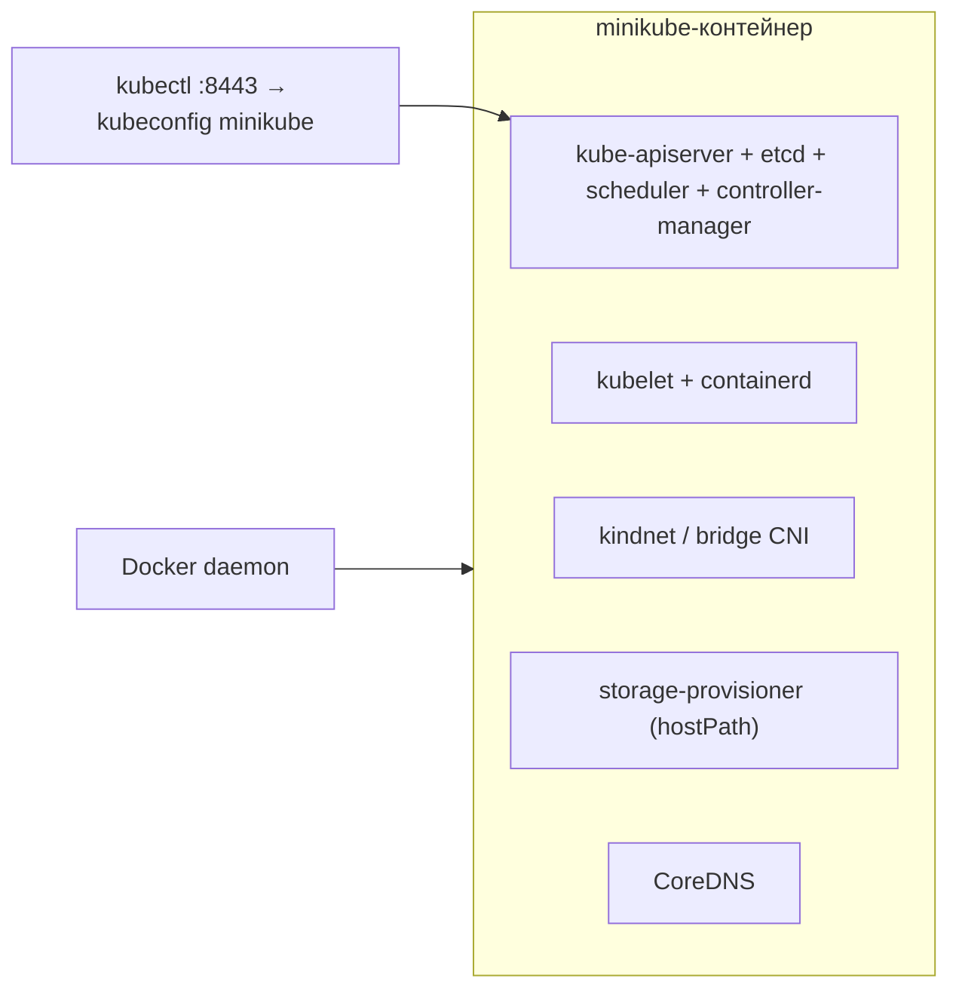

# Модуль 02. Кластер с нуля: Docker → minikube

> **PDF:** `02-cluster.pdf` — `tools/export-training-pdf.sh`.

Поднимаем одноузловой кластер, понимаем драйверы и ресурсы, учимся останавливать
и пересоздавать стенд не глядя. Пины курса: minikube v1.39.0, Kubernetes v1.37.0.

## Что ставит minikube



`--driver=docker` — контейнер вместо ВМ: быстро, без VirtualBox, единый путь на
Linux/macOS. Альтернативы (`kvm2`, `hyperkit`, `qemu2`) для курса не нужны;
`none` (bare metal) — только для серверов.

## Установка CLI

```bash
docker info --format '{{.ServerVersion}}'   # daemon обязан отвечать

# kubectl под версию кластера:
curl -LO "https://dl.k8s.io/release/v1.37.0/bin/linux/amd64/kubectl"
sudo install -m 755 kubectl /usr/local/bin/kubectl
# macOS: brew install kubectl

# helm 3.16+:
curl -fsSL -o get_helm.sh https://raw.githubusercontent.com/helm/helm/main/scripts/get-helm-3
chmod 700 get_helm.sh && ./get_helm.sh

# minikube v1.39.0+:
curl -LO https://storage.googleapis.com/minikube/releases/latest/minikube-linux-amd64
sudo install -m 755 minikube-linux-amd64 /usr/local/bin/minikube
```

`kubectl`/`helm` на `PATH` — жёсткое требование: без них Exec, Port-forward
и Helm releases в JKubeTerm покажут ошибку запуска процесса
([external-tools](../architecture/external-tools.md)).

## Старт, ресурсы, профили

```bash
minikube start --driver=docker --cpus=4 --memory=8192 --disk-size=40g
minikube status
kubectl cluster-info
kubectl get nodes -o wide
```

| Флаг | Минимум курса | Полный стек | Почему |
|---|---|---|---|
| `--cpus` | 2 | 4–6 | Prometheus + ArgoCD прожорливы |
| `--memory` | 4096 | 8192–12288 | OOMKilled лечится только памятью |
| `--disk-size` | 20g | 40g | образы + etcd + PVC |
| `--kubernetes-version` | дефолт профиля | `v1.37.0` | kubectl держите той же минорки |

Профили — несколько кластеров на одном Docker:

```bash
minikube start -p lab2 --driver=docker --kubernetes-version=v1.37.0 --cpus=2 --memory=4096
kubectl config get-contexts        # minikube, lab2
kubectl config use-context lab2
minikube delete -p lab2
```

JKubeTerm покажет оба контекста; повторный **Connect** переключит клиент
(старый закроется только после успешной проверки нового, `JKubeTermApp.java:103`).

## Аддоны: что включить сразу

```bash
minikube addons enable ingress
minikube addons enable metrics-server
minikube addons enable storage-provisioner
kubectl -n ingress-nginx get pods
kubectl -n kube-system get pods -l k8s-app=metrics-server
```

| Аддон | Даёт | Проверка в JKubeTerm |
|---|---|---|
| `ingress` | ingress-nginx controller | Namespace `ingress-nginx` → Deployments |
| `metrics-server` | `kubectl top`, будущий HPA | терминал: `kubectl top nodes` |
| `storage-provisioner` | дефолтный StorageClass + hostPath PV | **StorageClass** нет в видах — `kubectl get sc`; PVC — в видах |
| `dashboard` (опц.) | встроенный дашборд minikube | `minikube dashboard` (не путать с архивным k8s Dashboard 7.x) |

> Либо аддон `ingress`, либо Helm-релиз `ingress-nginx` из QuickStart —
> не оба: конфликт IngressClass и портов.

## Жизненный цикл стенда

```bash
minikube pause / minikube unpause   # заморозить/разморозить (экономия CPU)
minikube stop                       # остановить, данные сохраняются
minikube start                      # после reboot хоста
minikube service -n demo <svc> --url
minikube tunnel                     # LoadBalancer в отдельном терминале (нужен root)
minikube delete                     # ПОЛНОЕ удаление: контейнер, диски, профиль
docker volume prune                 # хвосты после delete (осторожно)
```

## Типовые failures старта

| Симптом | Причина → лечение |
|---|---|
| `DRV_AS_ROOT` | запуск от root → `--force` (только серверы/CI) или пользователь в группе `docker` |
| `Cannot connect to the Docker daemon` | Docker не запущен → Docker Desktop / `systemctl start docker` |
| `no space left` / `image pull backoff` на старте | мало диска → `docker system df`, чистка, `--disk-size` больше |
| `kubelet unhealthy` после `start` | битый профиль → `minikube delete` + старт заново (15 минут, данные песочницы не жалко) |
| Контекст есть, JKubeTerm не коннектится | `kubectl cluster-info` тоже падает → чините кластер, не клиент; если CLI ок — **↻ Config** |

## Проверь себя в JKubeTerm

- [ ] Поднимите профиль `lab2` на 2 CPU, подключитесь к нему в JKubeTerm, вернитесь на `minikube`.
- [ ] Включите `metrics-server`, выполните `kubectl top nodes` — цифры должны появиться за ~1 мин.
- [ ] Найдите Pod ingress-контроллера через фильтр `ingress` в namespace `ingress-nginx`, откройте логи.
- [ ] `minikube stop` → убедитесь, что Connect падает с сетевой ошибкой → `minikube start` → Connect снова.

## Ловушки

| Ошибка | Что на самом деле |
|---|---|
| Два ingress-контроллера | аддон + Helm-релиз одновременно — снесите один |
| `minikube delete` «съел данные» | так и задумано; ценное — в Git + `helm get values` ([admin guide](../guides/admin-guide.md)) |
| kubectl другой минорки, странные ошибки API | держите клиент ±1 от сервера |

Дальше: [03 — доступ: kubeconfig, RBAC, токены](03-access.md).
