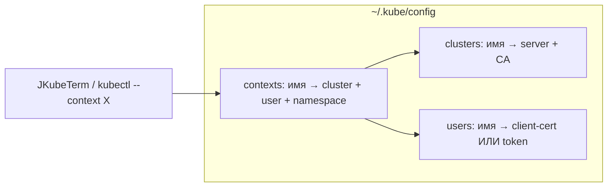
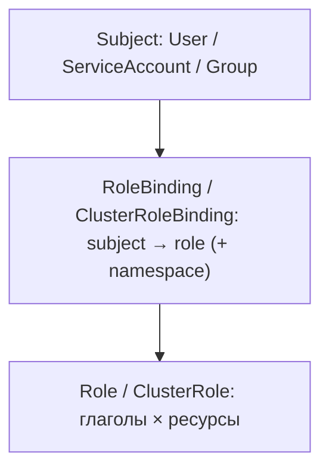

# Модуль 03. Доступ: kubeconfig, контексты, RBAC

> **PDF:** `03-access.pdf` — `tools/export-training-pdf.sh`.

Кто вы для API-сервера, как JKubeTerm вас представляет и как выдать доступ
коллеге (или дашборду) без раздачи `cluster-admin`.

## kubeconfig как адресная книга



```bash
kubectl config view --minify
kubectl config get-contexts
KUBECONFIG=~/.kube/config:~/.kube/lab.config kubectl config get-contexts
```

Правила слияния, которые повторяет JKubeTerm (`KubeconfigLoader.paths`,
[kubeconfig](../architecture/kubeconfig.md)):

- `$KUBECONFIG` — список через `:` (Linux/macOS), пустые/битые элементы пропускаются;
- без переменной — только `~/.kube/config`;
- дубли имён контекстов: побеждает **первый** файл в списке;
- Fabric8 `Config.fromKubeconfig` игнорирует `current-context` и exec-плагины —
  выбирайте контекст явно в комбо.

```bash
# второй контекст для view-only пользователя (пример из admin guide):
cp ~/.kube/config ~/.kube/lab-viewer.config   # затем вырежьте лишнее, вставьте токен
KUBECONFIG=~/.kube/config:~/.kube/lab-viewer.config mvn clean javafx:run
# в JKubeTerm появятся оба контекста
```

## RBAC за 10 минут



| Объект | Scope | Пример |
|---|---|---|
| `Role` / `RoleBinding` | namespace | разработчик правит Deployments только в `demo` |
| `ClusterRole` / `ClusterRoleBinding` | весь кластер | `view`, `cluster-admin`, чтение Nodes |
| `ServiceAccount` | namespace (субъект) | `lab-viewer`, ArgoCD-контроллер, CI-бот |

Встроенные ClusterRole: `view` (читать почти всё), `edit` (править в ns),
`admin` (всё в ns), `cluster-admin` (всё везде — только bootstrap).

JKubeTerm **не эскалирует**: запросы идут с вашими правами; cluster-scope виды
(Nodes, Namespaces, PV) при запрете просто упадут с Forbidden в диалог
([security](../operations/security.md)).

## Практика: view-only пользователь лаборатории

```bash
kubectl create serviceaccount lab-viewer -n default
kubectl create clusterrolebinding lab-viewer-view \
  --clusterrole=view --serviceaccount=default:lab-viewer
kubectl -n default create token lab-viewer --duration=24h
kubectl auth can-i --as=system:serviceaccount:default:lab-viewer list pods -n demo
kubectl auth can-i --as=system:serviceaccount:default:lab-viewer delete pods -n demo
# expected: yes / no
```

Токен — в Headlamp/Dashboard login либо в отдельный kubeconfig-контекст.
Подключите его в JKubeTerm вторым контекстом и убедитесь: листинги работают,
Apply/Delete падают с Forbidden.

## ServiceAccount для приложений

Каждый Pod получает токен своего SA в `/var/run/secrets/kubernetes.io/serviceaccount`
(если `automountServiceAccountToken: true`). Чарты (ArgoCD, Prometheus) создают
свои SA сами; давать им `cluster-admin` вручную не нужно — но проверьте, что
именно им дали:

```bash
kubectl -n argocd get clusterrolebinding -o wide | grep argocd
kubectl -n demo get rolebinding
```

## Проверь себя в JKubeTerm

- [ ] Создайте `lab-viewer`, подключите его контекст, откройте Nodes — видите?
  (view разрешает чтение Nodes — объясните почему.)
- [ ] Попробуйте Delete Pod'а под `lab-viewer` — зафиксируйте текст Forbidden.
- [ ] `kubectl auth can-i create deployments -n demo --as=...lab-viewer` — предскажите ответ до выполнения.
- [ ] Найдите в JKubeTerm ServiceAccount'ы ArgoCD: Namespace `argocd`, вид… —
  ага, вида ServiceAccounts в 14 нет. Где посмотрите? (Ответ: `kubectl get sa -n argocd`.)

## Ловушки

| Ошибка | Что на самом деле |
|---|---|
| «Дал Role, а доступа к Nodes нет» | Nodes — cluster-scope, нужен ClusterRole+Binding |
| Токен протух (`Unauthorized`) | токены временные — пересоздайте (`create token`), для робота — долгоживущий Secret типа `kubernetes.io/service-account-token` |
| Два контекста с одним именем | побеждает первый файл `$KUBECONFIG` — переименуйте |
| `current-context` не влияет на JKubeTerm | Fabric8 его игнорирует — выбирайте в комбо |

Дальше: [04 — workloads I: Pod, Deployment, rollout](04-workloads.md).
