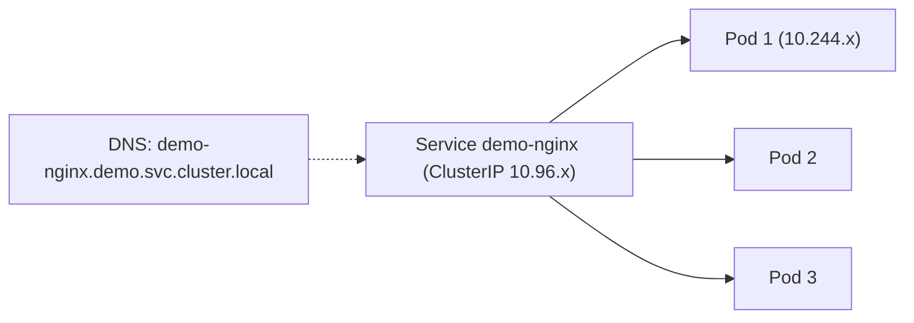

# Модуль 05. Сеть I: Service, port-forward, Ingress, TLS

> **PDF:** `05-services-ingress.pdf` — `tools/export-training-pdf.sh`.

Три способа достучаться до приложения: ClusterIP+port-forward (отладка),
NodePort/LoadBalancer (инфраструктурные), Ingress+TLS (пользовательский вход).
Предполагается Deployment `demo-nginx` из [модуля 04](04-workloads.md).

## Service: стабильная дверь к эфемерным Pod'ам

```yaml
apiVersion: v1
kind: Service
metadata:
  name: demo-nginx
  namespace: demo
spec:
  selector: {app: demo-nginx}
  ports: [{name: http, port: 80, targetPort: 80}]
  type: ClusterIP
```



| Type | Что делает | Когда использовать |
|---|---|---|
| `ClusterIP` (дефолт) | виртуальный IP только внутри кластера | всё внутреннее; наружу — через Ingress/forward |
| `NodePort` | порт 30000–32767 на каждом узле → Service | `minikube service --url` для быстрой проверки |
| `LoadBalancer` | просит внешний LB у облака | в minikube — только через `minikube tunnel` |
| `ExternalName` | CNAME-алиас наружу | прокси к внешней БД без IP в коде |

`selector` Service обязан совпадать с labels Pod'ов — иначе Endpoints пуст:

```bash
kubectl -n demo get endpoints demo-nginx   # должны быть 3 IP
```

## Port-forward: отладка через JKubeTerm

JKubeTerm: **Services** → `demo-nginx` → **Port forward** → `8080:80` →
`http://127.0.0.1:8080`. Правила (`JKubeTermApp.java:180`):

- формат `local:remote`, порты 1–65535, бинд строго `127.0.0.1` (не публикует наружу);
- процесс `kubectl port-forward` стартует на FX-потоке, живёт до выхода из приложения;
- кнопки «остановить» нет — держите по одному форварду на сервис.

Эквивалент в CLI: `kubectl -n demo port-forward svc/demo-nginx 8080:80`.
Форвард Pod'а (`pod/demo-nginx-xyz`) — к конкретному Pod'у, переживёт ли рестарт?
Нет: имя Pod'а сменится — форвардите Service.

## Ingress: вход для пользователей

Аддон уже включён ([модуль 02](02-cluster.md)). Ingress — правило «хост+путь →
Service», контроллер — реализация (nginx):

```yaml
apiVersion: networking.k8s.io/v1
kind: Ingress
metadata:
  name: demo
  namespace: demo
  annotations: {nginx.ingress.kubernetes.io/rewrite-target: /}
spec:
  ingressClassName: nginx
  rules:
    - host: demo.127.0.0.1.nip.io
      http:
        paths:
          - path: /
            pathType: Prefix
            backend:
              service: {name: demo-nginx, port: {number: 80}}
```

```bash
kubectl apply -f demo-ingress.yaml
# minikube: ingress доступен через IP профиля
minikube ip
curl -H "Host: demo.127.0.0.1.nip.io" http://$(minikube ip)/
```

Проверка в JKubeTerm: вид **Ingresses** в `demo`, **Services** контроллера
в `ingress-nginx`; логи контроллера — **Pods** в `ingress-nginx` → Pod logs.

## TLS через cert-manager

Чарт уже стоит (QuickStart §4.1). Staging-Issuer для лаборатории:

```yaml
apiVersion: cert-manager.io/v1
kind: ClusterIssuer
metadata:
  name: letsencrypt-staging
spec:
  acme:
    server: https://acme-staging-v02.api.letsencrypt.org/directory
    email: you@example.com
    privateKeySecretRef: {name: le-staging}
    solvers: [{http01: {ingress: {class: nginx}}}]
```

```yaml
# добавьте в Ingress:
# metadata.annotations: cert-manager.io/cluster-issuer: letsencrypt-staging
# spec.tls: [{hosts: [demo.example.com], secretName: demo-tls}]
```

Наблюдение: **Certificates** вида нет в 14 — смотрите `kubectl get certificate`,
а Secret `demo-tls` — в виде **ConfigMaps**? Нет — Secrets вообще нет в видах
JKubeTerm (только через YAML Pod'а/env). Это осознанный пробел каталога.

## DNS для лаборатории

Без настоящего домена: `*.nip.io` / `*.sslip.io` резолвят `IP.nip.io` в IP —
идеально для minikube. С настоящим доменом: A-запись на `minikube ip` (или
CNAME на туннель). `ExternalDNS` — за рамками курса, упомянут в admin guide.

## Проверь себя в JKubeTerm

- [ ] Откройте `demo-nginx` тремя путями: port-forward, `minikube service --url`, Ingress+curl. Какой пережил `restart` Deployment?
- [ ] Удалите label `app` у одного Pod'а (`kubectl label pod ... app-`) — что стало с Endpoints?
- [ ] Поставьте Service `type: NodePort`, найдите назначенный порт в YAML.
- [ ] Найдите в логах ingress-контроллера свой curl-запрос.

## Ловушки

| Ошибка | Что на самом деле |
|---|---|
| Endpoints пуст | селектор Service ≠ labels Pod'ов |
| Ingress 404 | не тот `ingressClassName`, два контроллера, правило не покрывает host/path |
| cert-manager не выпускает | ACME prod на тестовом домене → начните со staging; проверьте `kubectl describe challenge` |
| Форвард «висит» после удаления Pod'а | форвард привязан к имени — пересоздайте на Service |

Дальше: [06 — ConfigMap, Secret, PVC/PV](06-config-storage.md).
