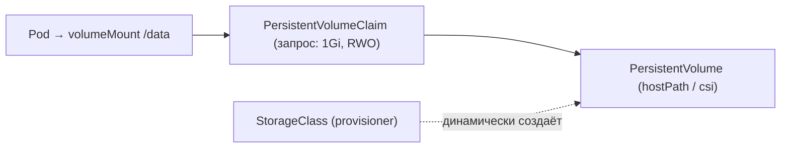

# Модуль 06. Конфигурация и данные: ConfigMap, Secret, PVC

> **PDF:** `06-config-storage.pdf` — `tools/export-training-pdf.sh`.

Отделяем конфиг от образа (ConfigMap/Secret) и данные от Pod'а (PVC/PV).
После модуля приложение переживает рестарт без потери данных и правится без
пересборки образа.

## ConfigMap: конфиг без пересборки

```yaml
apiVersion: v1
kind: ConfigMap
metadata:
  name: demo-config
  namespace: demo
data:
  APP_COLOR: green
  nginx.conf: |
    server { listen 80; location / { return 200 'color=$APP_COLOR\n'; } }
```

Два способа употребить:

```yaml
# 1. env-переменные:
envFrom: [{configMapRef: {name: demo-config}}]
# 2. файлы (volume):
volumes: [{name: cfg, configMap: {name: demo-config}}]
volumeMounts: [{name: cfg, mountPath: /etc/nginx/conf.d}]
```

```bash
kubectl apply -f demo-config.yaml
```

В JKubeTerm: вид **ConfigMaps** в `demo` → YAML справа; **New YAML**,
кстати, сеет именно шаблон ConfigMap. Правка: **Edit YAML** → **Apply YAML** →
**Restart** Deployment, чтобы Pod'ы перечитали mount (kubelet синкает файлы
~1 мин, env — только через пересоздание Pod'ов!).

## Secret: тот же ConfigMap, но base64 — и осторожность

```bash
kubectl -n demo create secret generic demo-secret \
  --from-literal=password=s3cr3t --from-literal=user=admin
kubectl -n demo get secret demo-secret -o jsonpath='{.data.password}' | base64 -d; echo
```

| Правило | Почему |
|---|---|
| base64 ≠ шифрование | в etcd лежит почти plaintext — включите encryption at rest в проде |
| Никогда в Git plaintext | SealedSecrets/ExternalSecrets (см. [модуль 10](10-security.md)) |
| Вида Secrets в JKubeTerm нет | смотрите через `kubectl get secret`; YAML Pod'а покажет только ссылки |
| **Save YAML…** утащит секреты на диск | не коммитьте экспорты |

Употребление — как ConfigMap: `secretRef` / `secretKeyRef` / volume с
`defaultMode: 0400`.

## PV, PVC, StorageClass: данные переживают Pod



minikube даёт дефолтный StorageClass через `storage-provisioner`:

```bash
kubectl get storageclass   # standard (default)
```

```yaml
apiVersion: v1
kind: PersistentVolumeClaim
metadata:
  name: demo-data
  namespace: demo
spec:
  accessModes: [ReadWriteOnce]
  resources: {requests: {storage: 1Gi}}
---
apiVersion: apps/v1
kind: Deployment
metadata:
  name: demo-writer
  namespace: demo
spec:
  replicas: 1
  strategy: {type: Recreate}   # RWO нельзя монтировать в 2 Pod'а сразу
  selector:
    matchLabels: {app: demo-writer}
  template:
    metadata:
      labels: {app: demo-writer}
    spec:
      containers:
        - name: writer
          image: busybox:1.36
          command: ["sh", "-c", "echo $(date) >> /data/log; sleep 3600"]
          volumeMounts: [{name: data, mountPath: /data}]
      volumes: [{name: data, persistentVolumeClaim: {claimName: demo-data}}]
```

```bash
kubectl apply -f demo-data.yaml
kubectl -n demo get pvc,pv
```

Проверка живучести в JKubeTerm:

1. **Pods** → `demo-writer-*` → **Exec command** → `/bin/sh`? Нет —
   exec принимает один executable без shell-парсинга; для `cat /data/log`
   используйте образ с нужным бинарником либо `kubectl exec -it`.
2. Проще: **Delete** Pod → ReplicaSet поднимет новый → **Pod logs** покажет,
   что `/data/log` сохранился (PV пережил Pod).
3. Виды **PersistentVolumeClaims** (namespaced) и **PersistentVolumes**
   (cluster-scope) — оба есть в каталоге.

AccessModes: `RWO` (один узел R/W), `ROX` (много R/O), `RWX` (много R/W —
нужен NFS/longhorn, hostPath minikube его не даёт). StatefulSet + RWO —
в [модуле 07](07-advanced-workloads.md).

## Проверь себя в JKubeTerm

- [ ] Поменяйте `APP_COLOR` через Edit YAML ConfigMap, рестартните Deployment, проверьте эффект.
- [ ] Создайте Secret через CLI, смонтируйте как env, убедитесь что в YAML Deployment'а видно только имя.
- [ ] Удалите Pod writer'а, докажите что данные на месте (логи нового Pod'а / exec `cat`).
- [ ] Поставьте Deployment с PVC в `replicas: 2` + RollingUpdate — объясните, почему второй Pod Pending.

## Ловушки

| Ошибка | Что на самом деле |
|---|---|
| Поменял ConfigMap, приложение не видит | env — только пересоздание Pod'ов; файлы — до ~1 мин kubelet-sync |
| `Multi-Attach error for volume` | RWO + 2 реплики — ставьте `Recreate` или RWX-драйвер |
| PVC Pending вечно | нет StorageClass / provisioner; в minikube включите `storage-provisioner` |
| Секрет в Git | отзовите, пересоздайте, почистите историю (BFG), включите sealed-secrets |

Дальше: [07 — StatefulSet, DaemonSet, Job, CronJob, HPA](07-advanced-workloads.md).
