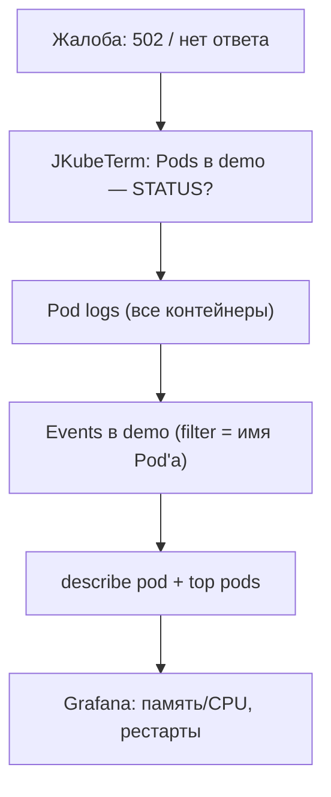

# Модуль 08. Наблюдаемость: логи, Events, метрики, Grafana

> **PDF:** `08-observability.pdf` — `tools/export-training-pdf.sh`.

Диагностика — это конвейер: логи Pod'а → Events namespace → метрики узла/Pod'а →
дашборды. Проходим его целиком, биндим каждый шаг к кнопке JKubeTerm.

## Ступень 1: логи Pod'а (JKubeTerm)

**Pods** → строка → **Pod logs** (`JKubeTermApp.java:152`):

1. Worker тянет `service.containers(ns, pod)` → FX показывает ChoiceDialog.
2. Выбор контейнера → worker читает последние **500 строк** (`tailingLines(500)`).
3. Консоль **перезаписывается** (`setText`), история не копится.

```bash
# эквивалент CLI с нюансами:
kubectl -n demo logs deploy/demo-nginx --tail=500
kubectl -n demo logs -l app=demo-nginx --all-containers --tail=100 -f   # streaming — только CLI
kubectl -n demo logs pod/demo-nginx-xyz -c nginx --previous            # логи УПАВШЕГО контейнера!
```

`--previous` — ключевой флаг для CrashLoop: JKubeTerm его не умеет (roadmap),
для упавших контейнеров идите в CLI. Многоконтейнерный Pod — перебирайте
контейнеры по очереди в диалоге.

## Ступень 2: Events namespace (JKubeTerm)

Вид **Events** в том же namespace читается как лента новостей кластера:

```bash
kubectl -n demo get events --sort-by=.lastTimestampSeen | tail -20
kubectl -n demo describe pod demo-nginx-xyz   # Events Pod'а внизу выдачи
```

| Событие | Значение |
|---|---|
| `Scheduled` | scheduler выбрал узел |
| `Pulled` / `Pulling` | образ тянется |
| `Started` / `Created` | контейнеры живы |
| `Unhealthy (readiness/liveness)` | пробы падают — смотрите логи приложения |
| `FailedMount` / `FailedScheduling` | тома/ресурсы — смотрите describes и PVC |
| `BackOff` | kubelet устал рестартить — CrashLoop |

В JKubeTerm Events — обычный вид с фильтром: вбейте имя Pod'а.

## Ступень 3: метрики (metrics-server)

```bash
kubectl top nodes
kubectl -n demo top pods --sort-by=cpu
kubectl -n monitoring top pods | sort -k3 -h | tail -5
```

Работает только при живой metrics-server и `resources.requests` у контейнеров.
Нет цифр минуту после старта — нормально (скрейп 60 с).

## Ступень 4: Prometheus + Grafana (kube-prometheus-stack)

Стек уже стоит (QuickStart §4.4). Что где:

| Компонент | Namespace `monitoring` | Доступ через JKubeTerm forward |
|---|---|---|
| Prometheus | `monitoring-kube-prometheus-prometheus` | `9090:9090` |
| Grafana | `monitoring-grafana` (admin/admin123) | `3000:80` |
| Alertmanager | `monitoring-kube-prometheus-alertmanager` | `9093:9093` |
| node-exporter (DaemonSet) | метрики узлов | — |
| kube-state-metrics | состояние объектов K8s | — |

Первые запросы в Prometheus UI (`Status → Targets` должны быть UP):

```promql
up{job="kubernetes-pods"}
container_memory_working_set_bytes{namespace="demo"}
rate(container_cpu_usage_seconds_total{namespace="demo"}[5m])
kube_pod_status_phase{namespace="demo", phase="Running"}
```

В Grafana откройте готовые дашборды «Kubernetes / Compute Resources» —
импортировать ничего не нужно, чарт уже положил их в ConfigMaps (вид
**ConfigMaps** в `monitoring` — десятки `grafana-dashboard-*`).

Своё приложение под скрейп: аннотации на Pod'ах + ServiceMonitor (продвинуто,
пример в [модуле 12](12-demo-apps.md) на podinfo).

## Типовой сценарий: «приложение легло»



Пройдите его на живом примере: сломайте образ
(`kubectl -n demo set image deploy/demo-nginx nginx=nginx:nonexistent`),
зафиксируйте `ImagePullBackOff` в Events, почините (`rollout undo`),
наблюдайте восстановление в Pods + Grafana.

## Проверь себя в JKubeTerm

- [ ] Найдите причину CrashLoop тестового Pod'а за 5 минут по конвейеру выше.
- [ ] Прочитайте логи **предыдущего** (упавшего) контейнера — каким инструментом? Почему не JKubeTerm?
- [ ] Покажите в Grafana график рестартов Pod'ов `demo` за последний час.
- [ ] Объясните, почему консоль JKubeTerm показывает только последнее сообщение.

## Ловушки

| Ошибка | Что на самом деле |
|---|---|
| Смотрю логи Deployment'а | логи — только у Pod'ов/контейнеров; Deployment логов не имеет |
| Логи пустые, Pod в CrashLoop | смотрите `--previous` в CLI |
| `top` висит без цифр | metrics-server ещё скрейпит / нет requests |
| Grafana пустая после переустановки | retention режет историю; дашборды — в ConfigMaps, данные — в PVC Prometheus |

Дальше: [09 — Helm и GitOps с ArgoCD](09-helm-gitops.md).
