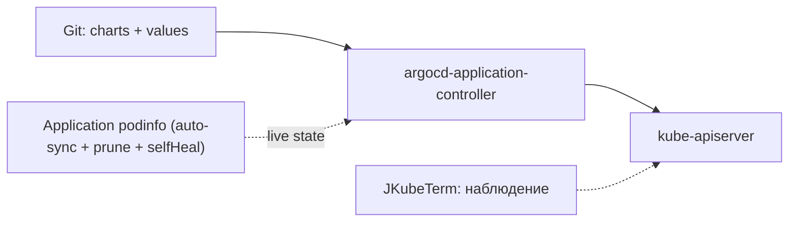

# Модуль 09. Helm и GitOps: charts, values, ArgoCD

> **PDF:** `09-helm-gitops.pdf` — `tools/export-training-pdf.sh`.

Два уровня автоматизации: Helm шаблонизирует манифесты (пакетный менеджер),
ArgoCD держит кластер в соответствии с Git (desired state). JKubeTerm в этой
схеме — наблюдатель: `helm list` только, установок нет (осознанно).

## Helm: anatomия чарта

```bash
helm repo add prometheus-community https://prometheus-community.github.io/helm-charts
helm repo update
helm search repo prometheus-community/kube-prometheus-stack --versions | head -5
helm show values prometheus-community/kube-prometheus-stack --version 91.0.0 | head -60
```

| Сущность | Что это |
|---|---|
| chart | tarball шаблонов + `Chart.yaml` + дефолтный `values.yaml` |
| release | установленная копия чарта (`monitoring` в ns `monitoring`) |
| values | ваши overrides поверх дефолтов (`--set`, `-f values.yaml`) |
| template | Go-template → YAML (`{{ .Values.grafana.adminPassword }}`) |

Золотое правило воспроизводимости: **храните values-файл и версию чарта**,
не надейтесь на `--set` в истории shell:

```bash
# values-monitoring.yaml:
grafana:
  adminPassword: admin123
prometheus:
  prometheusSpec:
    retention: 7d
    retentionSize: 20GB
```

```bash
helm upgrade --install monitoring prometheus-community/kube-prometheus-stack \
  --version 91.0.0 --namespace monitoring --create-namespace \
  -f values-monitoring.yaml
helm -n monitoring list
helm -n monitoring get values monitoring > values-monitoring.backup.yaml
helm -n monitoring rollback monitoring 2   # откат на ревизию 2
```

Проверка в JKubeTerm: кнопка **Helm releases** выполняет ровно
`helm --kube-context … --namespace <ns> list` в выбранном namespace
(`JKubeTermApp.java:220`). Релиз не виден? Проверьте комбо namespace —
дефолт `default`, а релизы живут в своих (`monitoring`, `headlamp`).

Свой минимальный чарт для демо (пригодится в [модуле 12](12-demo-apps.md)):

```bash
helm create demo-chart
helm lint demo-chart
helm template demo-chart --set replicaCount=2 | head -40
helm upgrade --install demo ./demo-chart -n demo --create-namespace
```

## ArgoCD: desired state из Git

Архитектура на пальцах:



Установка — pin манифеста (курс: v3.4.8, QuickStart §4.3):

```bash
kubectl create namespace argocd
kubectl apply -n argocd --server-side --force-conflicts \
  -f https://raw.githubusercontent.com/argoproj/argo-cd/v3.4.8/manifests/install.yaml
kubectl -n argocd rollout status deploy/argocd-server --timeout=300s
kubectl -n argocd get secret argocd-initial-admin-secret -o jsonpath='{.data.password}' | base64 -d; echo
```

Доступ — только port-forward через JKubeTerm (`argocd-server`, `8080:80`,
admin + секрет). После заведения личного пользователя секрет удалите.

Application — связь «Git → кластер»:

```yaml
# noinspection KubernetesUnknownResourcesInspection
apiVersion: argoproj.io/v1alpha1
# noinspection KubernetesUnknownResourcesInspection
kind: Application
metadata:
  name: podinfo
  namespace: argocd
spec:
  project: default
  source:
    repoURL: https://github.com/stefanprodan/podinfo
    targetRevision: HEAD        # в проде — pin тега!
    path: charts/podinfo
  destination:
    server: https://kubernetes.default.svc
    namespace: demo
  syncPolicy:
    automated: {prune: true, selfHeal: true}
    syncOptions: [CreateNamespace=true]
```

```bash
kubectl apply -f argocd-demo-app.yaml
kubectl -n argocd get application podinfo
```

Наблюдение в JKubeTerm: `demo` → **Deployments**/**Pods**/**Services** появляются
сами после sync; **Events** расскажет о проблемах синхронизации.
`OutOfSync`/`Degraded` — смотрите в UI ArgoCD (diff), чините Git, не кластер.

Ограничение AppProject для песочницы (чтобы демо не расползлось, см. admin guide):

```bash
kubectl apply -f - <<'EOF'
apiVersion: argoproj.io/v1alpha1
kind: AppProject
metadata:
  name: lab-demo
  namespace: argocd
spec:
  sourceRepos: [https://github.com/stefanprodan/podinfo]
  destinations: [{server: https://kubernetes.default.svc, namespace: demo}]
EOF
```

## Helm + ArgoCD вместе (production-путь)

ArgoCD умеет быть source'ом Helm-чарт напрямую (`chart:` вместо `path:`) —
так связка «версионированный чарт + values в Git + auto-sync» закрывает цикл.
Для лаборатории достаточно path-варианта выше; chart-вариант — упражнение
в [модуле 12](12-demo-apps.md).

## Проверь себя в JKubeTerm

- [ ] Найдите релиз `monitoring` кнопкой Helm releases (namespace `monitoring`). Почему его нет в `default`?
- [ ] Сделайте `helm get values`, поменяйте retention через `-f`, выполните upgrade, зафиксируйте новую ревизию.
- [ ] Создайте Application podinfo, удалите вручную один Pod в `demo` — кто его вернёт и почему (selfHeal)?
- [ ] Удалите Application — что стало с namespace `demo` (prune)?

## Ловушки

| Ошибка | Что на самом деле |
|---|---|
| `helm list` пуст | не тот namespace в комбо JKubeTerm |
| ArgoCD не синкает Helm-чарт | проверьте `targetRevision` и values-путь в diff UI |
| `HEAD` уехал, прод упал | pin тегов в проде; HEAD только для песочницы |
| Ручные правки «съедаются» | selfHeal возвращает desired из Git — правьте Git, не кластер |

Дальше: [10 — безопасность: RBAC, PodSecurity, NetworkPolicy](10-security.md).
