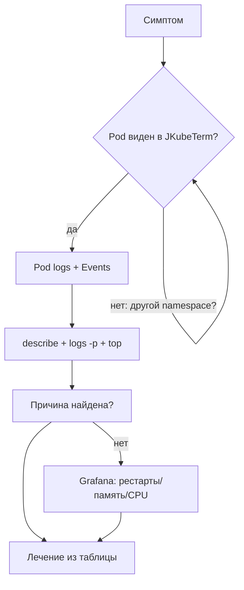

# Модуль 11. Диагностика: 15 сценариев «симптом → лечение»

> **PDF:** `11-troubleshooting.pdf` — `tools/export-training-pdf.sh`.

Справочник на стену: каждый сценарий — симптом, где смотреть в JKubeTerm,
добивка в CLI, причина, лечение. Конвейер из [модуля 08](08-observability.md)
здесь разворачивается в конкретику.

## Как пользоваться таблицей

1. Найдите симптом в левой колонке.
2. Выполните шаг JKubeTerm (вид + действие).
3. Если не хватило — добейте CLI-командой.
4. Лечите причину, не симптом (пересоздание Pod'а лечит 1 случай из 15).

## Pod'ы

| # | Симптом | JKubeTerm | CLI-добивка | Причина → лечение |
|---|---|---|---|---|
| 1 | `Pending` вечно | Pods → YAML Pod'а (`nodeName` пуст?) + Events по имени | `kubectl describe pod` → `Events` | Нет ресурсов/узла: `FailedScheduling` → освободить ресурсы, проверить taints, HPA-min |
| 2 | `ImagePullBackOff` | Events (`Failed to pull image`) | `kubectl describe pod` → точная ошибка registry | Нет образа/авторизации: `minikube image load`, `imagePullSecrets`, тег существует? |
| 3 | `CrashLoopBackOff` | Pod logs (все контейнеры) → Events | `kubectl logs -p` (previous!), `describe` → exit code | Падает приложение: код выхода 1 — логи; 137 — OOM (см. 4); 139 — segfault образа |
| 4 | `OOMKilled` | Events + YAML (`resources.limits`) | `kubectl top pods`, `describe` → `Reason: OOMKilled` | Лимит памяти мал: поднять `limits`, Grafana — утечка? retention Prometheus? |
| 5 | `CreateContainerConfigError` | Events (`Failed to create container`) | `describe` → какой env/volume не найден | Битая ссылка на ConfigMap/Secret key: создать ключ, поправить `keyRef` |
| 6 | `Init:Error` / `Init:CrashLoop` | Pod logs init-контейнера (выбор в диалоге!) | `kubectl logs <pod> -c <init>` | Упал init: миграции/ожидание сервиса — чините init, не основной контейнер |
| 7 | `Completed` у Job-Pod'а, а ждали вечность | Jobs → Pod logs | `kubectl get job` → `completions/duration` | Норма для Job; медленно — смотрите `backoffLimit` и ретраи |
| 8 | Pod жив, но в Service его нет | Endpoints нет в JKubeTerm → CLI | `kubectl get endpoints <svc>` пуст | Селектор ≠ labels: `kubectl get pod --show-labels`, поправить selector/labels |

## Сеть

| # | Симптом | JKubeTerm | CLI-добивка | Причина → лечение |
|---|---|---|---|---|
| 9 | Ingress 404 | Ingresses → YAML (host/path/class?) + логи контроллера | `curl -H "Host: …"`, `kubectl describe ingress` | Класс/правило/два контроллера; `ingressClassName: nginx`, один контроллер |
| 10 | Port-forward «висит» | — (процесс вне видов) | `ps aux \| grep port-forward`, другой local-порт | Привязка к имени Pod'а / занят порт: форвардить Service, сменить local-порт |
| 11 | `curl` timeout на Service | Services → YAML (ports/targetPort?) | `kubectl get endpoints`, `iptables` CNI | Нет endpoints (см. 8) или NetworkPolicy режет (см. модуль 10) |

## Конфигурация и диски

| # | Симптом | JKubeTerm | CLI-добивка | Причина → лечение |
|---|---|---|---|---|
| 12 | Правка ConfigMap не применяется | ConfigMaps → YAML сверить | `kubectl describe pod` → mounted generation | env — только пересоздание Pod'ов; файлы — до ~1 мин sync ([модуль 06](06-config-storage.md)) |
| 13 | PVC `Pending` | PVCs → YAML (`storageClassName`?) | `kubectl get sc`, `describe pvc` → `no provisioner` | Нет StorageClass/provisioner: `minikube addons enable storage-provisioner` |
| 14 | `Multi-Attach error` | Pods (два Pod'а на одном RWO) | `kubectl describe pod` → attach error | RWO + 2 реплики: `strategy: Recreate` или RWX-драйвер |

## RBAC и прочее

| # | Симптом | JKubeTerm | CLI-добивка | Причина → лечение |
|---|---|---|---|---|
| 15 | `Forbidden` / `Unauthorized` | диалог ошибки API | `kubectl auth can-i … --as=…`, `create token` | Нет прав / протух токен: Binding под нужный verb, свежий токен ([модуль 03](03-access.md)) |



## Лаборатория поломок (сломай и почини)

```bash
# 1. ImagePullBackOff:
kubectl -n demo set image deploy/demo-nginx nginx=nginx:nonexistent
# 2. CrashLoop:
kubectl -n demo set image deploy/demo-nginx nginx=busybox:1.36  # нет nginx-процесса под probes? подберите свой кейс
# 3. OOM: limits.memory=16Mi + нагрузка
# 4. Потеря endpoints: kubectl -n demo label deploy/demo-nginx app=broken --overwrite
# Чините каждый кейс по таблице, фиксируйте время. Норма выпускника: <5 мин на кейс.
kubectl -n demo rollout undo deploy/demo-nginx   # волшебная кнопка возврата
```

## Проверь себя в JKubeTerm

- [ ] Почините 4 поломки из лаборатории, каждый раз начиная с Pods+Events (не с CLI).
- [ ] Объясните, когда нужен `logs -p`, а когда достаточно Pod logs в JKubeTerm.
- [ ] Найдите exit code упавшего контейнера и сопоставьте с причиной (1/137/139).
- [ ] Составьте свой 16-й сценарий из реальной поломки стенда и добавьте в конспект.

## Ловушки

| Ошибка | Что на самом деле |
|---|---|
| Удаляю Pod — «лечу» CrashLoop | лечите образ/конфиг/лимиты; новый Pod упадёт так же |
| Смотрю логи не того контейнера | в Pod'е с sidecar сначала выберите правильный в ChoiceDialog |
| Игнорирую Events | 80% ответов уже там (`FailedMount`, `FailedScheduling`, `Unhealthy`) |

Дальше: [12 — три сквозных деплоя](12-demo-apps.md).
