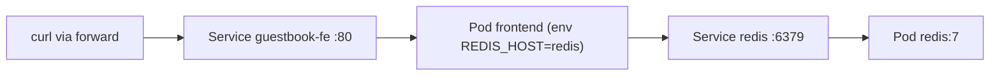

# Модуль 12. Три сквозных деплоя: от nginx до GitOps-стека

> **PDF:** `12-demo-apps.pdf` — `tools/export-training-pdf.sh`.

Финал курса: собираем всё в три рабочих приложения нарастающей сложности.
Каждое — полный цикл «манифест → деплой → доступ → наблюдение → сломай-почини».
После модуля — чеклист выпускника и карта «куда дальше».

## Демо 1. Static nginx (15 минут, только JKubeTerm + CLI-минимум)

Цель: первый зелёный цикл.

```yaml
apiVersion: v1
kind: Namespace
metadata:
  name: lab1
---
apiVersion: apps/v1
kind: Deployment
metadata:
  name: web
  namespace: lab1
spec:
  replicas: 2
  selector:
    matchLabels: {app: web}
  template:
    metadata:
      labels: {app: web}
    spec:
      containers:
        - name: nginx
          image: nginx:1.27
          ports: [{containerPort: 80}]
          readinessProbe: {httpGet: {path: /, port: 80}, periodSeconds: 5}
          resources:
            requests: {cpu: 50m, memory: 64Mi}
            limits: {cpu: 200m, memory: 128Mi}
---
apiVersion: v1
kind: Service
metadata:
  name: web
  namespace: lab1
spec:
  selector: {app: web}
  ports: [{port: 80, targetPort: 80}]
```

Шаги (всё через JKubeTerm, по одному документу за Apply):

1. Namespace `lab1` — через CLI (`kubectl create ns lab1`) либо Apply первого
   документа (Namespace — cluster-scope, `isClusterScoped` его пропускает).
2. Deployment → Apply → **Pods** → 2 Running → **Events** → Scheduled/Pulled/Started.
3. Service → Apply → **Port forward** `8080:80` → `curl 127.0.0.1:8080` → `Welcome to nginx!`.
4. **Scale** → 3 → убейте один Pod (**Delete**) → зафиксируйте воскрешение.
5. Сломайте образ (`Edit YAML` → `nginx:nonexistent` → Apply) → Events
   `ImagePullBackOff` → верните `1.27` → `rollout status` зелёный.

Чему научились: [04](04-workloads.md) + [05](05-services-ingress.md) + [08](08-observability.md) на пальцах.

## Демо 2. Guestbook (многоярусное: frontend + redis, 25 минут)

Цель: связность между сервисами, env-конфиг, два Deployment'а.



```bash
kubectl create ns lab2
kubectl -n lab2 apply -f - <<'EOF'
apiVersion: apps/v1
kind: Deployment
metadata:
  name: redis
spec:
  replicas: 1
  strategy: {type: Recreate}
  selector:
    matchLabels: {app: redis}
  template:
    metadata:
      labels: {app: redis}
    spec:
      containers:
        - name: redis
          image: redis:7
          ports: [{containerPort: 6379}]
          resources:
            requests: {cpu: 50m, memory: 64Mi}
            limits: {cpu: 200m, memory: 256Mi}
---
apiVersion: v1
kind: Service
metadata:
  name: redis
spec:
  selector: {app: redis}
  ports: [{port: 6379}]
EOF
```

Frontend — `us-docker.pkg.dev/google-samples/containers/gke/gb-frontend:v5`
с `env: [{name: GET_HOSTS_FROM, value: dns}]`:

```bash
kubectl -n lab2 apply -f - <<'EOF'
apiVersion: apps/v1
kind: Deployment
metadata:
  name: frontend
spec:
  replicas: 2
  selector:
    matchLabels: {app: guestbook-fe}
  template:
    metadata:
      labels: {app: guestbook-fe}
    spec:
      containers:
        - name: fe
          image: us-docker.pkg.dev/google-samples/containers/gke/gb-frontend:v5
          env: [{name: GET_HOSTS_FROM, value: dns}]
          ports: [{containerPort: 80}]
          resources:
            requests: {cpu: 50m, memory: 64Mi}
            limits: {cpu: 200m, memory: 128Mi}
---
apiVersion: v1
kind: Service
metadata:
  name: guestbook-fe
spec:
  selector: {app: guestbook-fe}
  ports: [{port: 80}]
  type: ClusterIP
EOF
kubectl -n lab2 rollout status deploy/frontend
```

Проверка в JKubeTerm: `lab2` → **Deployments** (2) → **Pods** (3) →
**Services** (2) → forward `8081:80` на `guestbook-fe` → впишите пару строк
в guestbook → удалите Pod frontend → убедитесь, что записи на месте (они в
redis, пережившем всё). Затем добавьте Ingress с хостом
`guestbook.127.0.0.1.nip.io` ([модуль 05](05-services-ingress.md)).

Чему научились: DNS-имена сервисов (`redis.lab2.svc.cluster.local`), env-связка,
многоярусность, Recreate для stateful-одиночки.

## Демо 3. Podinfo через ArgoCD + мониторинг (30 минут, production-миниатюра)

Цель: GitOps-цикл + метрики приложения.

```bash
kubectl apply -f - <<'EOF'
apiVersion: argoproj.io/v1alpha1
kind: Application
metadata:
  name: podinfo
  namespace: argocd
spec:
  project: default
  source:
    repoURL: https://github.com/stefanprodan/podinfo
    targetRevision: HEAD
    path: charts/podinfo
    helm:
      values: |
        replicaCount: 2
        resources:
          requests: {cpu: 50m, memory: 64Mi}
  destination:
    server: https://kubernetes.default.svc
    namespace: demo
  syncPolicy:
    automated: {prune: true, selfHeal: true}
    syncOptions: [CreateNamespace=true]
EOF
kubectl -n argocd get application podinfo
```

Наблюдение в JKubeTerm: `demo` → Deployment `podinfo` → Pods → Service
`podinfo` → forward `8082:9898` → `http://127.0.0.1:8082` (UI podinfo) и
`/metrics` (Prometheus-формат). Добавьте аннотации скрейпа и проверьте цель
в Prometheus UI (`Status → Targets`, QuickStart §4.4):

```bash
kubectl -n demo annotate svc podinfo prometheus.io/scrape=true prometheus.io/port=9898
```

Финал: поменяйте `replicaCount` в Application (`Edit` через `kubectl edit`
— ArgoCD-ресурсы JKubeTerm правит как обычный YAML через вид… — нет, CRD-видов
нет: только CLI), дождитесь auto-sync, зафиксируйте 3 Pod'а в JKubeTerm.
Удалите Application — `demo` очистится (prune).

## Чеклист выпускника

- [ ] Кластер: старт/стоп/пауза/профили/аддоны без подглядываний ([02](02-cluster.md)).
- [ ] Доступ: второй контекст, view-only токен, `auth can-i` ([03](03-access.md)).
- [ ] Workloads: Deployment/StatefulSet/DaemonSet/Job/CronJob — когда какой ([04](04-workloads.md), [07](07-advanced-workloads.md)).
- [ ] Сеть: ClusterIP/NodePort/forward/Ingress/TLS ([05](05-services-ingress.md)).
- [ ] Данные: ConfigMap/Secret/PVC, пережить рестарт ([06](06-config-storage.md)).
- [ ] HPA по CPU с нуля ([07](07-advanced-workloads.md)).
- [ ] Конвейер диагностики за 5 минут ([08](08-observability.md), [11](11-troubleshooting.md)).
- [ ] Helm values-файл + rollback; ArgoCD Application + selfHeal ([09](09-helm-gitops.md)).
- [ ] Hardening-чеклист наизусть ([10](10-security.md)).
- [ ] Три демо стоят одновременно (`lab1`, `lab2`, `demo`) и не мешают друг другу.

## Куда дальше

| Направление | Первый шаг после курса |
|---|---|
| CKA/CKAD | `killer.sh` симуляторы; курс покрывает ~70% CKA-blueprint |
| Production-кластер | kubeadm/talos вместо minikube; 3 control-plane; etcd-бэкапы (admin guide) |
| Service mesh | Linkerd (проще) → Istio (мощнее); mTLS между `lab2` сервисами |
| Progressive delivery | Argo Rollouts (canary podinfo) вместо RollingUpdate |
| Secrets management | ExternalSecrets + Vault вместо ручных Secret'ов |
| JKubeTerm контрибьюшн | roadmap-3 (остановка форвардов), roadmap-4 (API discovery) — [roadmap](../operations/roadmap.md) |

Спасибо за прохождение. Ломайте стенд дальше — теперь вы знаете, как его чинить.
